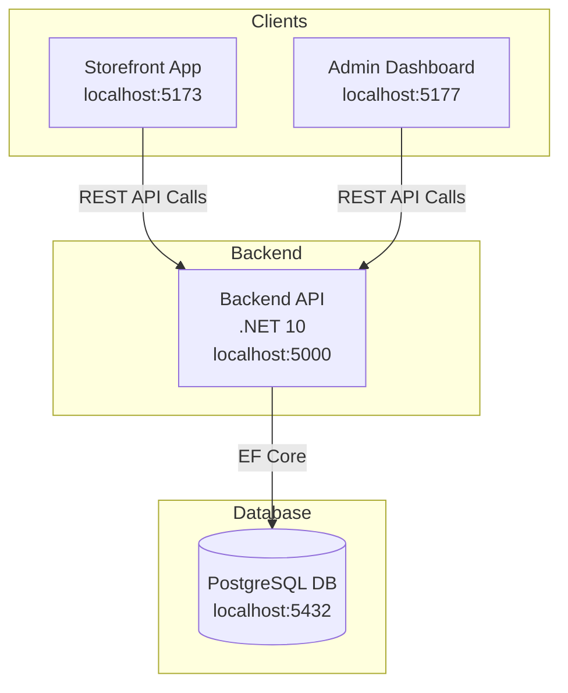

# E-Commerce Platform

This is a full-stack e-commerce platform built with a modern architecture. It features a customer-facing storefront, a separate administration dashboard for management, and a robust backend API. The entire application is containerized with Docker for consistent and easy setup.

## Table of Contents

- [Key Features](#key-features)
- [Tech Stack](#tech-stack)
- [Project Architecture](#project-architecture)
- [For AI Assistants](#for-ai-assistants)
- [Getting Started](#getting-started)
  - [Prerequisites](#prerequisites)
- [Running the Application](#running-the-application)
  - [Method 1: Using Docker (Recommended)](#method-1-using-docker-recommended)
  - [Method 2: Running Services Locally](#method-2-running-services-locally)
- [Accessing the Applications](#accessing-the-applications)
- [API Documentation](#api-documentation)
- [Running Tests](#running-tests)

## Key Features

- **User Authentication:** Secure user registration and login using JWT.
- **Product Management:** Full CRUD operations for products and categories.
- **Shopping Cart:** Persistent shopping cart for authenticated users.
- **Order Processing:** Complete workflow for order creation and management.
- **Customer Reviews:** Users can leave ratings and reviews on products.
- **Wishlist:** Ability for users to save items for later.
- **Promo Codes:** Admins can create and manage discount codes.
- **Admin Dashboard:** Centralized interface for managing users, products, orders, and inventory.

## Tech Stack

A detailed list of the technologies and major libraries used across the project.

### Backend

- **Framework:** .NET 10, ASP.NET Core
- **Database:** PostgreSQL with Entity Framework Core
- **Architecture:** Clean Architecture
- **API Documentation:** Swagger (Swashbuckle)
- **Authentication:** JWT (JSON Web Tokens)
- **Validation:** FluentValidation
- **Mapping:** AutoMapper
- **Logging:** Serilog

### Frontend (Admin & Storefront)

- **Framework:** React 19
- **Language:** TypeScript
- **Build Tool:** Vite
- **State Management:** Redux Toolkit
- **Routing:** React Router
- **API Client:** Axios
- **UI (Admin):** Material-UI (MUI)

### Database & Infrastructure


- **Containerization:** Docker, Docker Compose

- **Database:** PostgreSQL

## For AI Assistants

AI coding assistants should start with `.ai/README.md`.

- Canonical docs hub: `.ai/README.md`
- Quick start: `.ai/quick-start.md`
- Feature implementation workflow: `.ai/workflows/adding-feature.md`
- Database migrations workflow: `.ai/workflows/database-migrations.md`
- Backend error handling rules: `.ai/backend/error-handling.md`
- Common mistakes to avoid: `.ai/reference/common-mistakes.md`


## System Architecture


The diagram below illustrates the high-level architecture of the E-Commerce platform. The system is composed of two independent frontend applications that communicate with a central backend API, which in turn connects to a PostgreSQL database.





## Project Architecture


The project follows a modern, decoupled architecture to ensure separation of concerns and maintainability.


### Backend: Clean Architecture


The backend is structured using the principles of **Clean Architecture**. This separates the code into the following layers:


-   **`Core`**: Contains domain entities, enums, and core business interfaces. It has no external dependencies.


-   **`Application`**: Contains the application's business logic, services, DTOs, and validation. It depends only on the `Core` layer.


-   **`Infrastructure`**: Handles external concerns like data access (Entity Framework, repositories), file storage, and third-party API integrations. It depends on the `Application` layer.


-   **`API`**: The entry point of the backend, which exposes the application's functionality via a RESTful API. It depends on the `Application` and `Infrastructure` layers.


### Frontend: Dual Applications


The frontend consists of two distinct Single Page Applications (SPAs):


-   **`storefront`**: The public-facing website where customers can browse products, manage their cart, and place orders.


-   **`admin`**: A private dashboard for administrators to manage products, categories, orders, users, and view analytics.


## Database Seeding


On startup, the application automatically seeds the database with sample data to provide a functional out-of-the-box experience. This is handled by seeder classes found in the `ECommerce.Infrastructure` project.


The following data is seeded:


-   **Users:** A default admin user and several sample customer accounts.


-   **Categories:** A variety of product categories.


-   **Products:** A range of sample products distributed across the seeded categories.


## API Endpoint Examples


While the full API can be explored via the [Swagger UI](#api-documentation), here are a few examples of common endpoints.


**Get All Products**


```http


GET /api/products?PageNumber=1&PageSize=10


```


*Response:*


```json


{


  "products": [


    {


      "id": "...",


      "name": "Sample Product",


      "price": 99.99,


      "description": "A description of the sample product."


    }


  ],


  "pagination": {


    "currentPage": 1,


    "totalPages": 5,


    "pageSize": 10,


    "totalCount": 50


  }


}


```


**Add Item to Cart**


```http


POST /api/cart


```


*Body:*


```json


{


  "productId": "product-id-guid",


  "quantity": 1


}


```


## Code Style and Linting


### Frontend


The frontend projects use **ESLint** to enforce code quality and style consistency. To run the linter, navigate to either the `src/frontend/admin` or `src/frontend/storefront` directory and run:


```sh


npm run lint


```


### Backend


The backend code follows standard C# and ASP.NET Core conventions. Code style is generally maintained by the default settings in Visual Studio or JetBrains Rider.


## Getting Started


### Prerequisites


Ensure you have the following software installed on your local machine:


-   [.NET 10 SDK](https://dotnet.microsoft.com/download/dotnet/10.0)


-   [Node.js](https://nodejs.org/) (v20.x or later recommended)


-   [Docker Desktop](https://www.docker.com/products/docker-desktop/)


## Running the Application


### Method 1: Using Docker (Recommended)


This is the simplest way to get all services up and running. The configuration is managed by the `docker-compose.yml` file.


1.  **Launch the services:**


    From the root directory, run the following command:


    ```sh


    docker-compose up --build -d


    ```


    The first launch will take a few minutes as Docker downloads images and builds the application containers.


### Method 2: Running Services Locally


This method requires manual configuration of environment variables.


#### Environment Variables


Before running locally, you must set up the required environment variables.


**Backend Configuration (.NET User Secrets or `appsettings.Development.json`)**


| Key                                     | Purpose                      | Example Value                                                              |


| --------------------------------------- | ---------------------------- | -------------------------------------------------------------------------- |


| `ConnectionStrings:DefaultConnection` | Database connection string.   | `Host=localhost;Database=ECommerceDb;Username=ecommerce;Password=YourPassword123!` |


| `Jwt:SecretKey`                         | Secret key for signing JWTs. | `your-super-secret-key-min-32-characters-long-must-be-used`                |


| `Jwt:Issuer`                            | The issuer of the JWT.       | `ecommerce-api`                                                            |


| `Jwt:Audience`                          | The audience of the JWT.     | `ecommerce-client`                                                         |


**Frontend Configuration (`.env` file)**


| Variable       | Purpose                   | Example Value                     |


| -------------- | ------------------------- | --------------------------------- |


| `VITE_API_URL` | URL of the backend API. | `http://localhost:5000/api` |


#### Execution


1.  **Run the Backend:**


    -   Navigate to `src/backend`.


    -   Ensure you have configured the secrets mentioned above.


    -   Run `dotnet run --project ECommerce.API`.


2.  **Run the Frontends:**


    -   For each frontend (`src/frontend/storefront` and `src/frontend/admin`):


    -   Create a `.env` file from `.env.example`.


    -   Run `npm install` then `npm run dev`.


## Accessing the Applications


Once the services are running, you can access them at the following URLs:


-   **Storefront:** [http://localhost:5173](http://localhost:5173)


-   **Admin Dashboard:** [http://localhost:5177](http://localhost:5177)


-   **Backend API:** [http://localhost:5000](http://localhost:5000)


## API Documentation


The backend API includes Swagger for interactive documentation. When the API is running, you can access the Swagger UI directly at its root URL:


-   **Swagger UI:** [http://localhost:5000](http://localhost:5000)


## Running Tests


To run the backend's suite of unit and integration tests, navigate to the `src/backend` directory and run the standard dotnet test command:


```sh


cd src/backend


dotnet test


```
