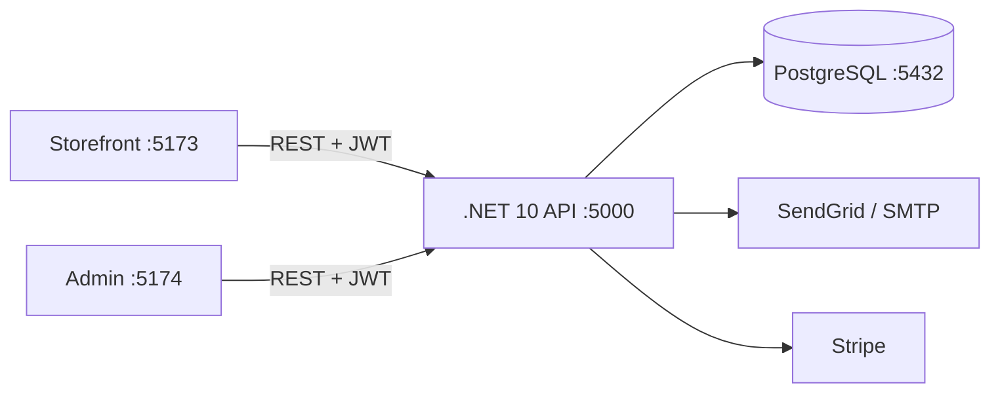

# E-Commerce Platform

A full-stack e-commerce platform — customer storefront, admin dashboard, and REST API.



---

## Stack

| | Technology |
|-|-----------|
| Backend | .NET 10, ASP.NET Core, Clean Architecture |
| Frontend | React 19, TypeScript, Redux Toolkit, RTK Query |
| Database | PostgreSQL + Entity Framework Core |
| Auth | JWT + Refresh Token Rotation |
| Payments | Stripe *(integration in progress)* |
| Email | SendGrid / SMTP (configurable) |
| Infra | Docker, Serilog, Polly, FluentValidation |

---

## Quick start

```bash
# 1. Start database
docker compose up -d

# 2. Backend
cd src/backend/ECommerce.API && dotnet run

# 3. Storefront
cd src/frontend/storefront && npm install && npm run dev

# 4. Admin (optional)
cd src/frontend/admin && npm install && npm run dev
```

Full setup with env vars: [docs/onboarding.md](docs/onboarding.md)

Default admin after seed: `admin@ecommerce.com` / `Admin123!`

---

## Documentation

### Start here
| | |
|-|-|
| [docs/onboarding.md](docs/onboarding.md) | Run locally in 10 minutes, common issues |
| [docs/environments.md](docs/environments.md) | Every environment variable for all services |

### Understand the system
| | |
|-|-|
| [docs/architecture.md](docs/architecture.md) | Layer diagrams, frontend state, system context |
| [docs/database.md](docs/database.md) | ERD (14 tables), concurrency model, indexes |
| [docs/data-flow.md](docs/data-flow.md) | Checkout, auth, cart sync sequence diagrams |

### Reference
| | |
|-|-|
| [docs/api-reference.md](docs/api-reference.md) | All 82+ endpoints, auth level, query params |
| [docs/error-codes-reference.md](docs/error-codes-reference.md) | All error codes + HTTP status mapping |
| [docs/security.md](docs/security.md) | JWT, RBAC, CSRF, rate limiting, prod checklist |

### Engineering
| | |
|-|-|
| [docs/testing.md](docs/testing.md) | Test pyramid, how to write tests, coverage goals |
| [docs/performance.md](docs/performance.md) | N+1 prevention, caching, pagination rules |
| [docs/monitoring.md](docs/monitoring.md) | Logging, health checks, alerts |

### Status & decisions
| | |
|-|-|
| [docs/feature-status.md](docs/feature-status.md) | Completion matrix, known gaps |
| [docs/senior-dev-next.md](docs/senior-dev-next.md) | Prioritised next steps |
| [docs/adr/](docs/adr/) | Architecture Decision Records |

### Contributing
| | |
|-|-|
| [CONTRIBUTING.md](CONTRIBUTING.md) | Branch naming, PR process, code style |
| [CHANGELOG.md](CHANGELOG.md) | Version history |
| [CLAUDE.md](CLAUDE.md) | Critical architectural rules |
| [.ai/](.ai/) | Workflows and patterns |

Full docs index: [docs/README.md](docs/README.md)

---

## Project structure

```
src/
├── backend/
│   ├── ECommerce.Core/           Entities, Result<T>, ErrorCodes, interfaces
│   ├── ECommerce.Application/    Services (17), DTOs, validators
│   ├── ECommerce.Infrastructure/ Repositories, EF Core, 4 migrations
│   ├── ECommerce.API/            Controllers (12), middleware, Program.cs
│   └── ECommerce.Tests/          170+ tests (unit + integration)
└── frontend/
    ├── storefront/               Customer SPA — 7 features, RTK Query
    ├── admin/                    Admin dashboard SPA
    └── shared/                   Shared components and utilities
```

---

## Tests

```bash
cd src/backend && dotnet test                        # 80+ backend tests
cd src/frontend/storefront && npm run test           # 90+ frontend tests
cd src/frontend/storefront && npm run test:e2e       # Playwright E2E
```

---

## For AI assistants

Start with `CLAUDE.md`, then `.ai/README.md`.
