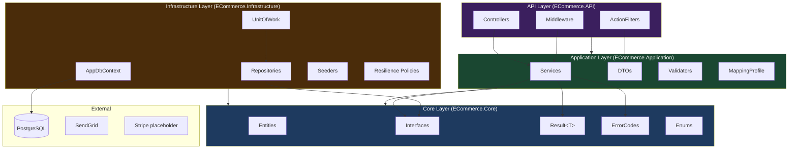
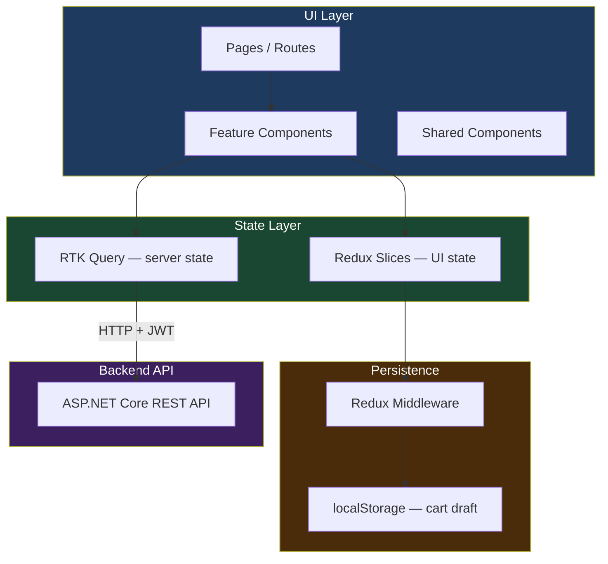
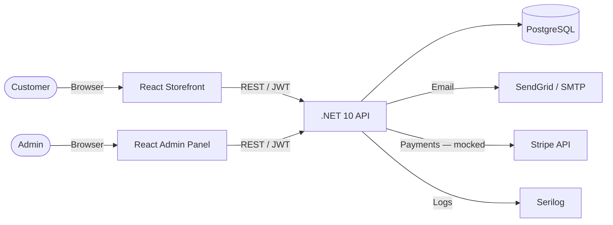

# Architecture Overview

## Clean Architecture — Backend

**Dependency rule:** arrows point inward only — API → Application → Core, Infrastructure → Core.

---

## Frontend Architecture

**Rule:** Components never call `fetch` directly — all server state goes through RTK Query. Slices hold UI-only state (auth flags, toast, cart local copy).

---

## System Context

