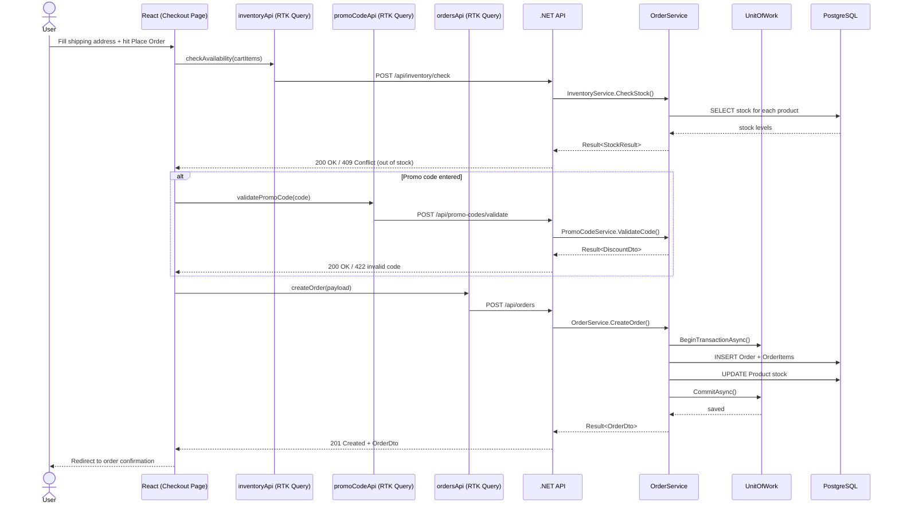
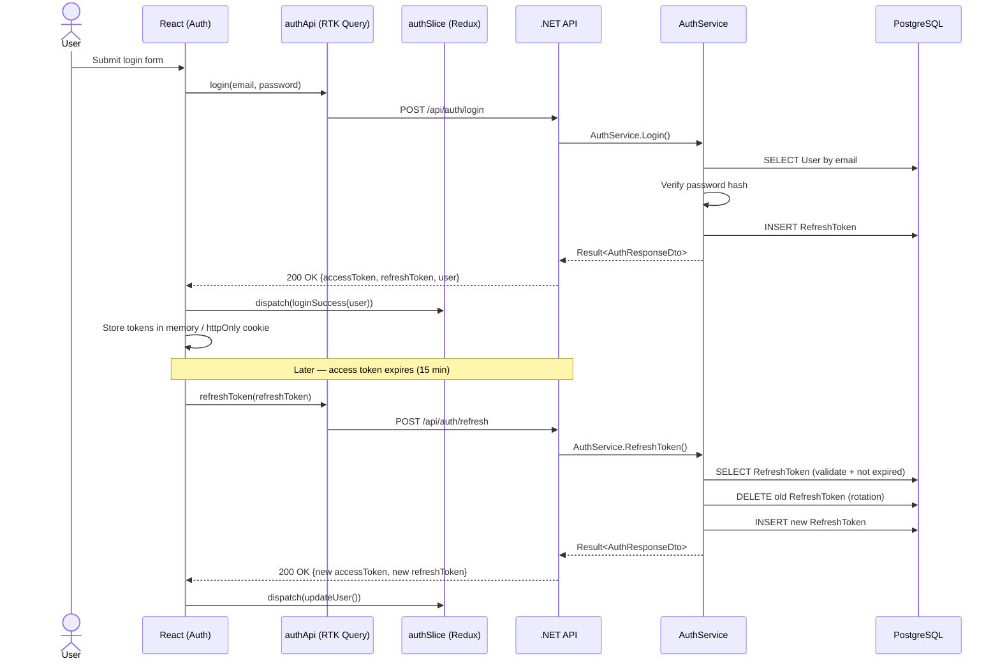
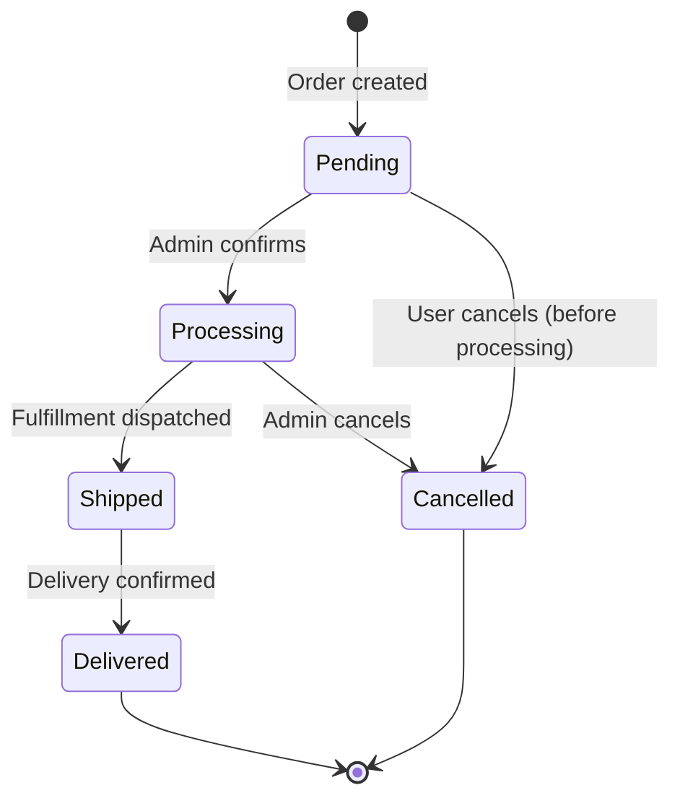
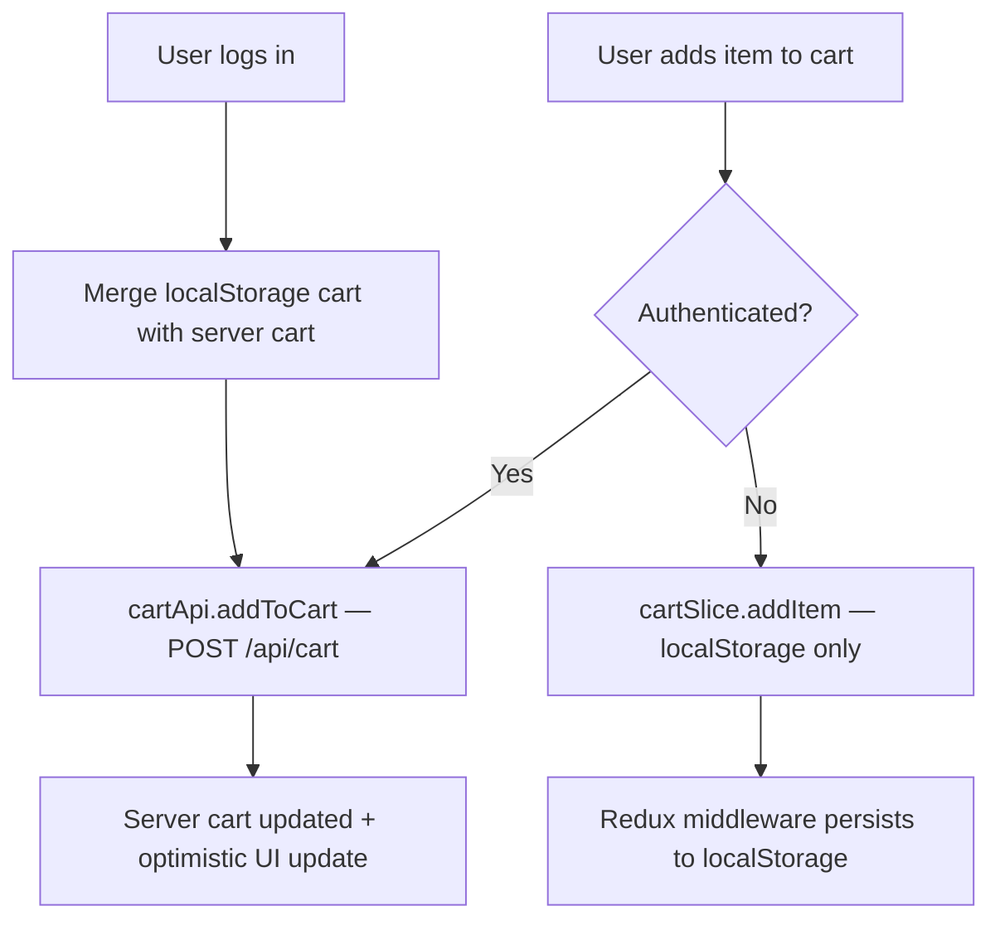

# Key Data Flows

## Checkout Flow (end-to-end)

```mermaid
sequenceDiagram
    actor User
    participant React as React (Checkout Page)
    participant invAPI as inventoryApi (RTK Query)
    participant promoAPI as promoCodeApi (RTK Query)
    participant orderAPI as ordersApi (RTK Query)
    participant API as .NET API
    participant SVC as OrderService
    participant UOW as UnitOfWork
    participant DB as PostgreSQL

    User->>React: Fill shipping address + hit Place Order
    React->>invAPI: checkAvailability(cartItems)
    invAPI->>API: POST /api/inventory/check
    API->>SVC: InventoryService.CheckStock()
    SVC->>DB: SELECT stock for each product
    DB-->>SVC: stock levels
    SVC-->>API: Result<StockResult>
    API-->>React: 200 OK / 409 Conflict (out of stock)

    alt Promo code entered
        React->>promoAPI: validatePromoCode(code)
        promoAPI->>API: POST /api/promo-codes/validate
        API->>SVC: PromoCodeService.ValidateCode()
        SVC-->>API: Result<DiscountDto>
        API-->>React: 200 OK / 422 invalid code
    end

    React->>orderAPI: createOrder(payload)
    orderAPI->>API: POST /api/orders
    API->>SVC: OrderService.CreateOrder()
    SVC->>UOW: BeginTransactionAsync()
    SVC->>DB: INSERT Order + OrderItems
    SVC->>DB: UPDATE Product stock
    SVC->>UOW: CommitAsync()
    UOW-->>SVC: saved
    SVC-->>API: Result<OrderDto>
    API-->>React: 201 Created + OrderDto
    React-->>User: Redirect to order confirmation
```

---

## Auth Flow — Login & Token Refresh

```mermaid
sequenceDiagram
    actor User
    participant React as React (Auth)
    participant authAPI as authApi (RTK Query)
    participant slice as authSlice (Redux)
    participant API as .NET API
    participant SVC as AuthService
    participant DB as PostgreSQL

    User->>React: Submit login form
    React->>authAPI: login(email, password)
    authAPI->>API: POST /api/auth/login
    API->>SVC: AuthService.Login()
    SVC->>DB: SELECT User by email
    SVC->>SVC: Verify password hash
    SVC->>DB: INSERT RefreshToken
    SVC-->>API: Result<AuthResponseDto>
    API-->>React: 200 OK {accessToken, refreshToken, user}
    React->>slice: dispatch(loginSuccess(user))
    React->>React: Store tokens in memory / httpOnly cookie

    Note over React,API: Later — access token expires (15 min)

    React->>authAPI: refreshToken(refreshToken)
    authAPI->>API: POST /api/auth/refresh
    API->>SVC: AuthService.RefreshToken()
    SVC->>DB: SELECT RefreshToken (validate + not expired)
    SVC->>DB: DELETE old RefreshToken (rotation)
    SVC->>DB: INSERT new RefreshToken
    SVC-->>API: Result<AuthResponseDto>
    API-->>React: 200 OK {new accessToken, new refreshToken}
    React->>slice: dispatch(updateUser())
```

---

## Order Status Lifecycle

```mermaid
stateDiagram-v2
    [*] --> Pending : Order created
    Pending --> Processing : Admin confirms
    Processing --> Shipped : Fulfillment dispatched
    Shipped --> Delivered : Delivery confirmed
    Pending --> Cancelled : User cancels (before processing)
    Processing --> Cancelled : Admin cancels
    Delivered --> [*]
    Cancelled --> [*]
```

---

## Cart Sync Strategy

```mermaid
flowchart TD
    A[User adds item to cart] --> B{Authenticated?}
    B -->|Yes| C[cartApi.addToCart — POST /api/cart]
    B -->|No| D[cartSlice.addItem — localStorage only]
    C --> E[Server cart updated + optimistic UI update]
    D --> F[Redux middleware persists to localStorage]
    G[User logs in] --> H[Merge localStorage cart with server cart]
    H --> C
```
