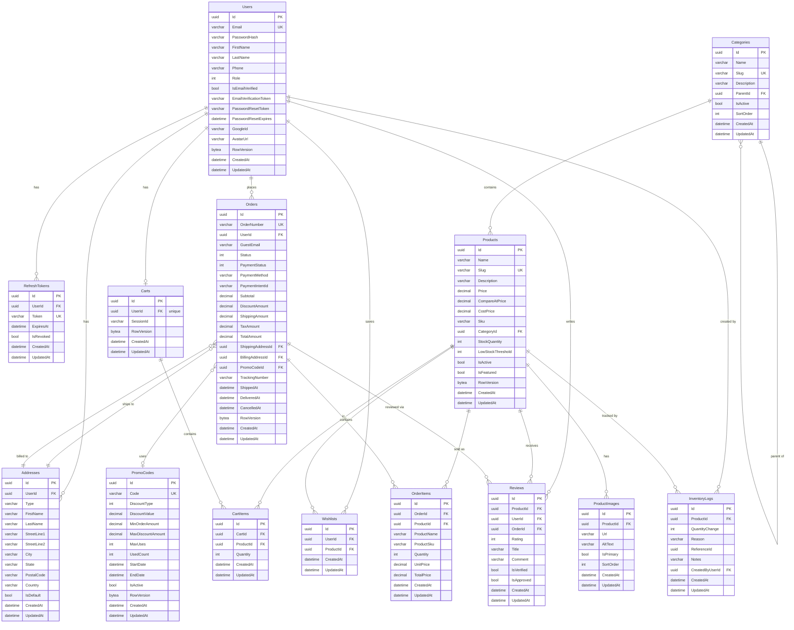

# Database Schema

## Entity Relationship Diagram

---

## Concurrency Control

Five tables use **optimistic locking** via a `RowVersion` column (PostgreSQL `bytea`). EF Core throws a `DbUpdateConcurrencyException` if two transactions modify the same row simultaneously.

| Table | Why |
|-------|-----|
| `Users` | Profile updates from multiple sessions |
| `Products` | Stock adjustments from concurrent orders |
| `Carts` | Simultaneous add-to-cart from multiple tabs |
| `Orders` | Status updates racing with cancellations |
| `PromoCodes` | `UsedCount` increment under high load |

---

## Delete Behaviors

| Relationship | Behavior | Effect |
|---|---|---|
| User → Addresses | Cascade | Deleting a user removes all addresses |
| User → RefreshTokens | Cascade | Deleting a user revokes all sessions |
| User → Cart | Cascade | Deleting a user removes the cart |
| User → Wishlists | Cascade | Deleting a user clears the wishlist |
| Product → ProductImages | Cascade | Deleting a product removes images |
| Product → CartItems | Cascade | Item removed from all carts |
| Cart → CartItems | Cascade | Clearing a cart removes all items |
| Order → OrderItems | Cascade | Deleting an order removes its lines |
| Order → User | **SetNull** | User deletion keeps order history (audit) |
| Order → PromoCode | **SetNull** | PromoCode deletion keeps order history |
| OrderItem → Product | **SetNull** | Product deletion keeps order history |
| Review → User | **SetNull** | User deletion keeps product reviews |
| Category → Product | **SetNull** | Deleting a category orphans products |
| Category → Category (parent) | **SetNull** | Deleting parent makes subcategory top-level |

---

## Key Indexes

| Table | Index | Purpose |
|-------|-------|---------|
| Users | `Email` (unique) | Login lookup |
| Categories | `Slug` (unique) | URL routing |
| Products | `Slug` (unique) | URL routing |
| Products | `IsActive`, `IsFeatured` | Catalog filtering |
| Products | `(IsActive, Price)` composite | Filtered + sorted browsing |
| Carts | `SessionId` | Guest cart lookup |
| CartItems | `(CartId, ProductId)` unique | Prevent duplicate cart lines |
| Wishlists | `(UserId, ProductId)` unique | Prevent duplicate wishlist entries |
| Orders | `OrderNumber` (unique) | Customer-facing order lookup |
| Orders | `UserId`, `Status`, `CreatedAt` | Order history queries |
| RefreshTokens | `Token` (unique) | Token validation |
| InventoryLogs | `ProductId`, `(ProductId, CreatedAt)` | Stock history queries |
