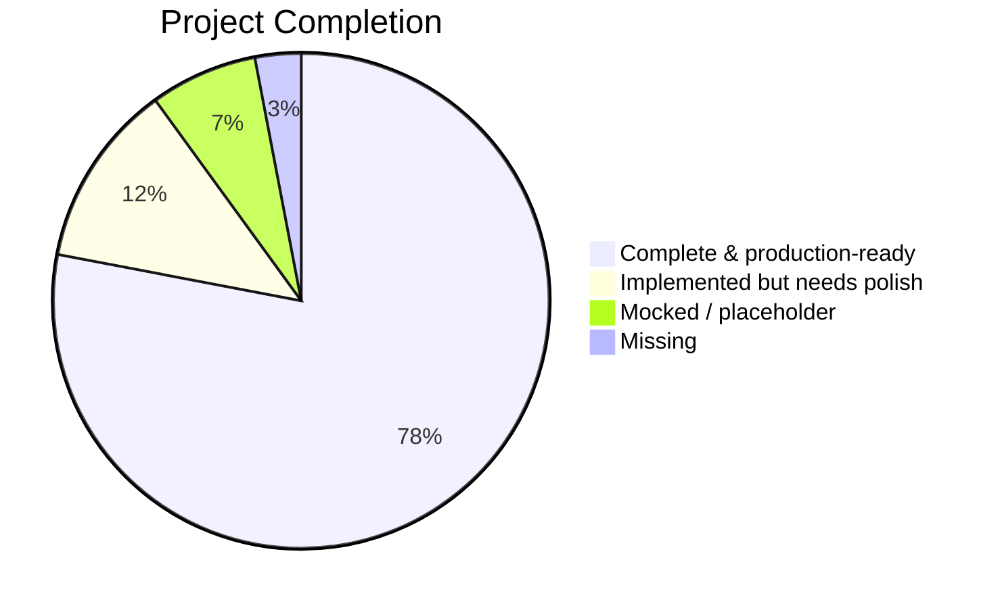
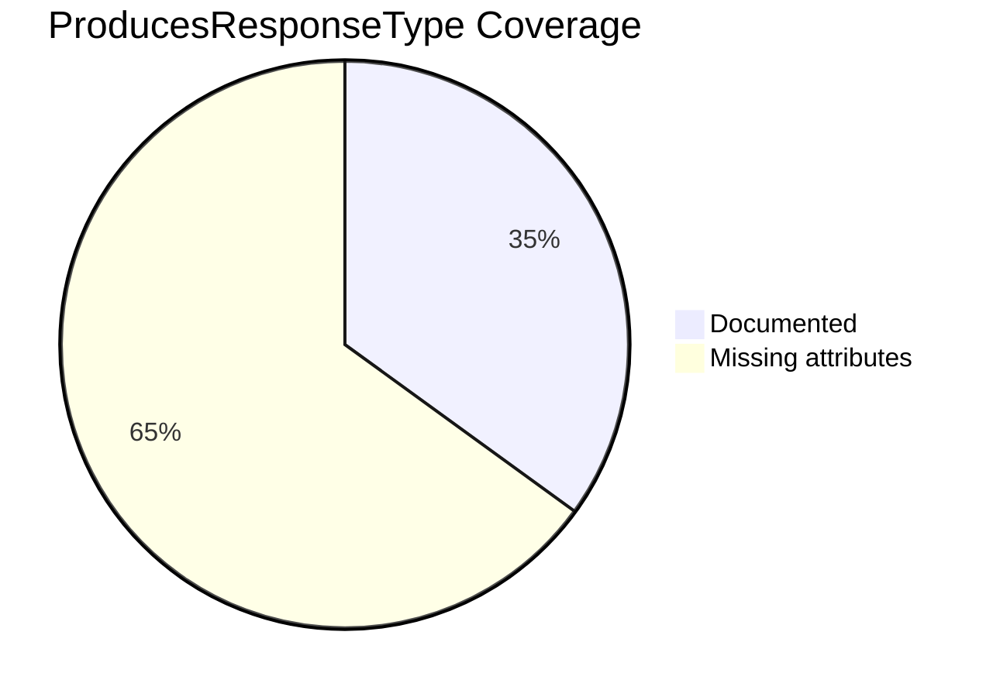
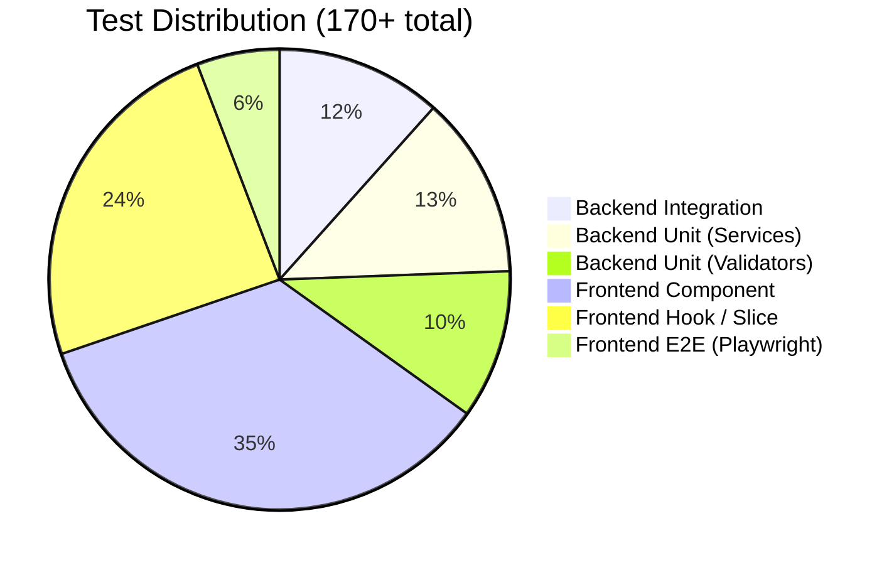

# Feature Completion Status

## Overall Health

---

## Backend — Services & Endpoints

| Domain | Service | Endpoints | Tests | Status |
|--------|---------|-----------|-------|--------|
| Auth | AuthService | 6 | ✅ Integration | Complete |
| Products | ProductService | 9 | ✅ Integration | Complete |
| Categories | CategoryService | 6 | ✅ Integration | Complete |
| Cart | CartService | 5 | ✅ Integration | Complete |
| Orders | OrderService | 8 | ✅ Integration | Complete |
| Payments | PaymentService | 5 | ✅ Integration | **Mocked** |
| Inventory | InventoryService | 7 | ✅ Integration | Complete |
| Promo Codes | PromoCodeService | 6 | ✅ Integration | Complete |
| Reviews | ReviewService | 6 | ✅ Integration | Complete |
| Wishlist | WishlistService | 4 | ✅ Integration | Complete |
| Profile | UserService | 4 | ✅ Integration | Complete |
| Dashboard | DashboardService | 1 | ✅ Integration | Complete |
| Email | EmailService | — | Unit | Dual impl (pick one) |
| Idempotency | IdempotencyStore | — | Unit | Complete |

**Totals:** 17/17 services implemented · 82+ endpoints · 20+ integration test files

---

## API Contract Coverage

~87 endpoints missing `[ProducesResponseType]` — breaks OpenAPI/Swagger contract and client code generation.

---

## Frontend — User Flows

| Flow | Page(s) | RTK Query | Redux Slice | E2E Ready | Status |
|------|---------|-----------|-------------|-----------|--------|
| Browse products | `/products`, `/products/:slug` | ✅ productApi | — | ✅ | Complete |
| Search & filter | `/products` | ✅ productApi | — | ✅ | Complete |
| Auth (login/register) | `/login`, `/register` | ✅ authApi | ✅ authSlice | ✅ | Complete |
| Password reset | `/forgot-password`, `/reset-password` | ✅ authApi | — | ✅ | Complete |
| Shopping cart | `/cart` | ✅ cartApi | ✅ cartSlice | ✅ | Complete |
| Checkout | `/checkout` | ✅ ordersApi + inventoryApi + promoCodeApi | — | ✅ | Complete |
| Order history | `/orders` | ✅ ordersApi | — | ✅ | Complete |
| Order detail | `/orders/:id` | ✅ ordersApi | — | ✅ | Complete |
| User profile | `/profile` | ✅ profileApi | — | Partial | Lightweight API |
| Wishlist | `/wishlist` | ✅ wishlistApi | — | Partial | Lightweight API |
| Reviews | (on product page) | ✅ reviewsApi | — | ✅ | Complete |
| Payment processing | (in checkout) | paymentsApi (methods only) | — | ❌ | **No real payment** |

---

## Test Coverage Summary

---

## Known Gaps

| Gap | Impact | Where |
|-----|--------|-------|
| Payment integration is mocked | Cannot process real payments | `PaymentService.cs`, `paymentsApi.ts` |
| ~87 missing `[ProducesResponseType]` | Broken OpenAPI contract | All controllers |
| Profile & Wishlist API lightweight | Limited functionality | `profileApi.ts`, `wishlistApi.ts` |
| Email provider not selected | Ambiguous in prod | `Program.cs` DI registration |
| `LoadingFallback` mixes concerns | UX inconsistency on slow load | `AppShell`, route lazy loading |
