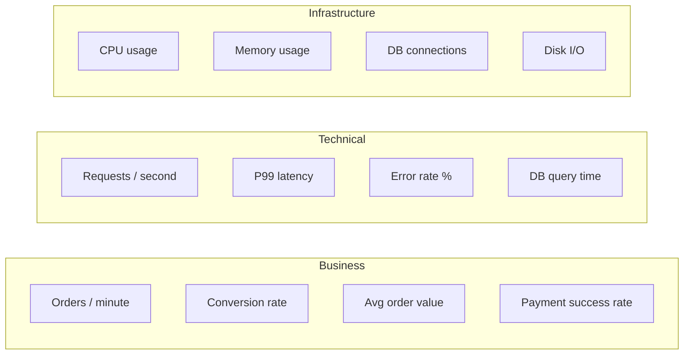

# Monitoring & Observability

## Logging — Serilog

The backend uses **Serilog** with structured logging. Every log entry is a structured JSON object, not a plain string.

```csharp
// Good — structured, searchable
_logger.LogInformation("Order created {OrderId} for user {UserId} total {Total}",
    order.Id, userId, order.TotalAmount);

// Bad — string concatenation, unsearchable
_logger.LogInformation("Order " + order.Id + " created");
```

### Log levels

| Level | When to use |
|-------|-------------|
| `Debug` | Detailed flow tracing (dev only, never in prod) |
| `Information` | Key business events: order created, user registered, payment processed |
| `Warning` | Expected problems: stock low, promo code invalid, rate limit hit |
| `Error` | Unexpected failures: DB timeout, external API error, unhandled exception |
| `Critical` | System is down or data may be corrupted |

Production minimum level: `Warning`. Development: `Debug`.

---

### What gets logged automatically

| Event | Level | Where |
|-------|-------|-------|
| Every HTTP request (method, path, status, duration) | Information | Serilog request logging middleware |
| Unhandled exceptions | Error | `GlobalExceptionMiddleware` |
| Correlation ID on every request | — | `CorrelationIdMiddleware` (added to response headers + log context) |
| Validation failures | Warning | `ValidationFilterAttribute` |
| DB query errors | Error | EF Core + Serilog integration |

---

### Sensitive data masking

`StringMaskingExtensions` masks sensitive fields before they reach the log sink.

**Never log:**
- Passwords or password hashes
- Raw JWT or refresh tokens
- Full credit card numbers
- Personal identification numbers

```csharp
// Masked automatically
_logger.LogInformation("User {Email} reset password", email.Mask());
```

---

### Correlation ID

Every request gets a `X-Correlation-ID` header (generated if not provided by the client). It's added to every log entry via Serilog's `LogContext.PushProperty`. Use it to trace a full request across log lines:

```
grep "X-Correlation-ID: abc-123" logs/*.json
```

---

## Health checks

Two health check endpoints:

| Endpoint | Auth | What it checks |
|----------|------|----------------|
| `GET /health` | Public | Overall health (liveness) |
| `GET /health/ready` | Public | Readiness (DB connection + dependencies) |

Response format:
```json
{
  "status": "Healthy",
  "results": {
    "database": { "status": "Healthy", "duration": "00:00:00.012" },
    "memory": { "status": "Healthy", "data": { "allocatedMegabytes": 45 } }
  }
}
```

Use `GET /health/ready` as the **readiness probe** in Kubernetes/Docker. Use `GET /health` as the **liveness probe**.

---

## Request tracing — what to watch in logs

### Order creation flow
```
[Information] Received POST /api/orders correlationId=abc-123
[Information] Stock check passed for 3 items orderId=... correlationId=abc-123
[Information] Order created orderId=xxx orderNumber=ORD-2026-... total=199.99 correlationId=abc-123
[Information] Response 201 duration=243ms correlationId=abc-123
```

### Failed payment
```
[Information] Received POST /api/payments/process correlationId=def-456
[Warning]     Payment failed orderId=xxx reason=PAYMENT_AMOUNT_MISMATCH correlationId=def-456
[Information] Response 400 duration=87ms correlationId=def-456
```

### Unhandled exception
```
[Error] Unhandled exception on POST /api/orders
        System.TimeoutException: The operation has timed out
        at ECommerce.Infrastructure.Repositories.OrderRepository...
        correlationId=ghi-789
[Information] Response 500 duration=30012ms correlationId=ghi-789
```

---

## Alerts to configure in production

| Alert | Condition | Severity |
|-------|-----------|----------|
| Error rate spike | >5% of requests return 5xx in 5 min | High |
| P99 latency | >2000ms for >5 min | Medium |
| Health check failing | `/health/ready` returns non-200 | Critical |
| DB connection pool exhausted | Pool wait >500ms average | High |
| Memory pressure | Allocated memory >80% limit | Medium |
| Repeated 401 spike | >50 401s/min from same IP | High (credential stuffing) |
| Payment failures | >10% payment failure rate | High |
| Low stock | Product `StockQuantity < LowStockThreshold` | Low (business alert) |

---

## Key metrics to track



---

## Local log viewing

In development, Serilog outputs to the console with pretty formatting. For structured log files:

```bash
# View last 100 log lines
tail -100 logs/ecommerce-.log

# Search by correlation ID
grep "abc-123" logs/ecommerce-*.log

# Count errors in last hour
grep "\"Level\":\"Error\"" logs/ecommerce-$(date +%Y%m%d).log | wc -l
```

Log files are written to the `logs/` directory at the project root (configured in `appsettings.json`).

---

## Frontend error tracking

The storefront uses an `ErrorBoundary` component to catch React render errors and display a fallback UI. In production, these should be forwarded to an error tracking service (Sentry, Datadog).

Add to `src/frontend/storefront/.env.production`:
```env
VITE_SENTRY_DSN=https://...
```

Toast notifications surface RTK Query errors to the user via the `toastSlice`.
