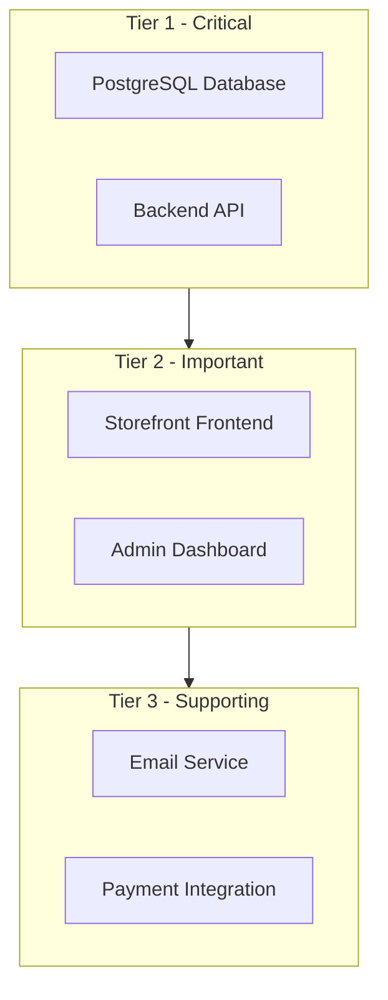
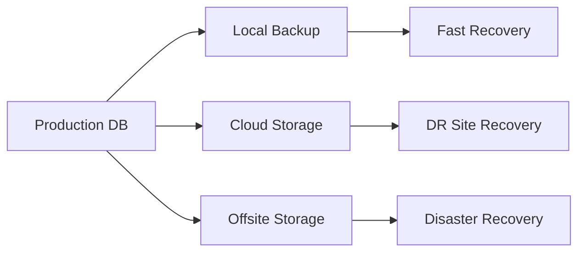
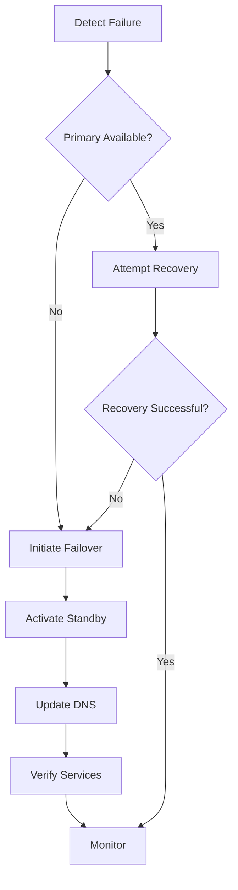
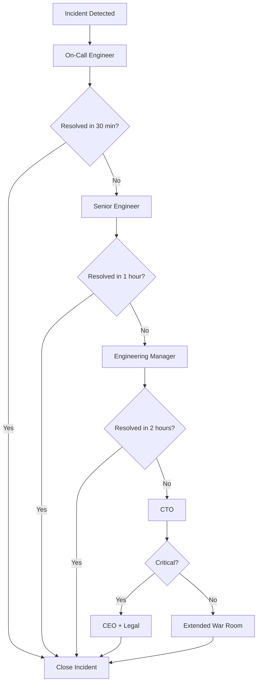

# Disaster Recovery Plan

## Document Information

| Field | Value |
|-------|-------|
| Version | 1.0 |
| Last Updated | 2026-02-18 |
| Owner | Operations Team |
| Status | Active |
| Next Review Date | 2026-05-18 |

---

## Table of Contents

1. [Executive Summary](#1-executive-summary)
2. [Backup Strategy](#2-backup-strategy)
3. [Recovery Procedures](#3-recovery-procedures)
4. [Failover Procedures](#4-failover-procedures)
5. [Testing Schedule](#5-testing-schedule)
6. [Contact Information](#6-contact-information)
7. [Appendices](#7-appendices)

---

## 1. Executive Summary

### 1.1 Purpose

This Disaster Recovery Plan (DRP) provides procedures for recovering the E-Commerce platform from major outages, data loss, or catastrophic failures. It ensures business continuity and minimizes data loss in disaster scenarios.

### 1.2 Recovery Objectives

| Metric | Target | Description |
|--------|--------|-------------|
| **RTO** | 4 hours | Maximum acceptable downtime before system restoration |
| **RPO** | 1 hour | Maximum acceptable data loss measured in time |

### 1.3 Critical Systems Identification



#### Tier 1 - Critical Systems

| System | Component | Recovery Priority | RTO |
|--------|-----------|-------------------|-----|
| Database | PostgreSQL | 1 | 2 hours |
| Backend API | ASP.NET Core | 2 | 1 hour |

#### Tier 2 - Important Systems

| System | Component | Recovery Priority | RTO |
|--------|-----------|-------------------|-----|
| Storefront | React Application | 3 | 30 minutes |
| Admin Dashboard | React Application | 4 | 30 minutes |

#### Tier 3 - Supporting Services

| System | Component | Recovery Priority | RTO |
|--------|-----------|-------------------|-----|
| Email | SendGrid/SMTP | 5 | 4 hours |
| Payments | Stripe/PayPal | 6 | 4 hours |

### 1.4 Disaster Scenarios

| Scenario | Probability | Impact | Recovery Strategy |
|----------|-------------|--------|-------------------|
| Database corruption | Low | Critical | Restore from backup |
| Server failure | Medium | High | Provision new server |
| Data center outage | Low | Critical | Failover to DR site |
| Ransomware attack | Low | Critical | Restore from backup |
| Accidental data deletion | Medium | High | Point-in-time recovery |
| Network failure | Medium | High | Network reconfiguration |

---

## 2. Backup Strategy

### 2.1 Database Backup Schedule

| Backup Type | Frequency | Retention | Storage Location |
|-------------|-----------|-----------|------------------|
| Full Backup | Daily at 02:00 UTC | 30 days | Primary + Offsite |
| Incremental Backup | Hourly | 7 days | Primary + Offsite |
| WAL Archiving | Continuous | 7 days | Primary + Offsite |

### 2.2 Backup Storage Locations



| Location | Type | Purpose | Access |
|----------|------|---------|--------|
| Local Volume | Docker Volume | Fast recovery | On-server |
| Cloud Storage | S3/Compatible | DR site recovery | API Access |
| Offsite Storage | Secure Location | Disaster recovery | Secure Access |

### 2.3 Backup Procedures

#### Automated Full Backup Script

```bash
#!/bin/bash
# Daily Full Backup Script
# Run via cron at 02:00 UTC

DATE=$(date +%Y%m%d_%H%M%S)
BACKUP_DIR="/backups/postgresql"
DB_NAME="ECommerceDb"
DB_USER="ecommerce"

# Create backup directory
mkdir -p $BACKUP_DIR

# Perform full backup
docker exec ecommerce_db pg_dump -U $DB_USER -d $DB_NAME -F c -f /tmp/backup_$DATE.dump

# Copy backup from container
docker cp ecommerce_db:/tmp/backup_$DATE.dump $BACKUP_DIR/full_$DATE.dump

# Upload to cloud storage
aws s3 cp $BACKUP_DIR/full_$DATE.dump s3://ecommerce-backups/postgresql/full/

# Cleanup old backups - keep last 30 days
find $BACKUP_DIR -name "full_*.dump" -mtime +30 -delete

# Log completion
echo "[$(date)] Full backup completed: full_$DATE.dump" >> /var/log/backup.log
```

#### Automated Incremental Backup Script

```bash
#!/bin/bash
# Hourly Incremental Backup Script
# Run via cron at minute 0

DATE=$(date +%Y%m%d_%H%M%S)
BACKUP_DIR="/backups/postgresql/wal"
DB_NAME="ECommerceDb"

# Create backup directory
mkdir -p $BACKUP_DIR

# Archive WAL files
docker exec ecommerce_db psql -U ecommerce -d $DB_NAME -c "SELECT pg_switch_wal();"

# Copy WAL files
docker exec ecommerce_db find /var/lib/postgresql/data/pg_wal -name "0000*" -mmin -60 -exec docker cp ecommerce_db:{} $BACKUP_DIR/ \;

# Upload to cloud storage
aws s3 sync $BACKUP_DIR/ s3://ecommerce-backups/postgresql/wal/

# Cleanup old WAL files - keep last 7 days
find $BACKUP_DIR -name "0000*" -mtime +7 -delete

# Log completion
echo "[$(date)] WAL backup completed" >> /var/log/backup.log
```

### 2.4 Backup Verification Procedures

#### Daily Verification Checklist

```markdown
## Daily Backup Verification
Date: _______________
Verified By: _______________

[ ] Check backup job completion in logs
[ ] Verify backup file exists in primary location
[ ] Verify backup file exists in cloud storage
[ ] Check backup file size is reasonable
[ ] Verify backup timestamp is current
[ ] Check backup job error count is zero

Notes:
_______________________________
```

#### Weekly Backup Integrity Test

```bash
#!/bin/bash
# Weekly Backup Integrity Test
# Run every Sunday at 06:00 UTC

DATE=$(date +%Y%m%d)
BACKUP_DIR="/backups/postgresql"
TEST_DB="test_restore_$DATE"

# Get latest backup
LATEST_BACKUP=$(ls -t $BACKUP_DIR/full_*.dump | head -1)

# Create test database
docker exec ecommerce_db psql -U ecommerce -c "CREATE DATABASE $TEST_DB;"

# Attempt restore
docker exec ecommerce_db pg_restore -U ecommerce -d $TEST_DB -v $LATEST_BACKUP

# Verify restore
TABLE_COUNT=$(docker exec ecommerce_db psql -U ecommerce -d $TEST_DB -t -c "SELECT COUNT(*) FROM information_schema.tables WHERE table_schema = 'public';")

# Cleanup test database
docker exec ecommerce_db psql -U ecommerce -c "DROP DATABASE $TEST_DB;"

# Log results
if [ "$TABLE_COUNT" -gt 0 ]; then
    echo "[$(date)] Backup verification PASSED: $TABLE_COUNT tables restored" >> /var/log/backup-verify.log
else
    echo "[$(date)] Backup verification FAILED" >> /var/log/backup-verify.log
    # Send alert
    curl -X POST $ALERT_WEBHOOK -d "Backup verification failed for $LATEST_BACKUP"
fi
```

### 2.5 Retention Policy

| Backup Type | Local Retention | Cloud Retention | Notes |
|-------------|-----------------|-----------------|-------|
| Full Daily | 7 days | 30 days | Compressed format |
| Incremental | 24 hours | 7 days | WAL files |
| Monthly Archive | N/A | 12 months | First of month |

---

## 3. Recovery Procedures

### 3.1 Database Restore Procedure

#### Prerequisites

- Access to backup storage
- Database container running or ability to start it
- Sufficient disk space for restore

#### Step-by-Step Recovery

```markdown
## Database Recovery Procedure

### Step 1: Assess the Situation
[ ] Identify the type of failure
[ ] Determine if point-in-time recovery is needed
[ ] Identify the target recovery time if applicable
[ ] Notify stakeholders of recovery operation

### Step 2: Prepare for Recovery
[ ] Stop application services to prevent data conflicts
    ```bash
    docker stop ecommerce_api
    ```
[ ] Verify backup availability
    ```bash
    ls -la /backups/postgresql/
    ```
[ ] Download backup from cloud if needed
    ```bash
    aws s3 cp s3://ecommerce-backups/postgresql/full/[BACKUP_FILE] /backups/postgresql/
    ```

### Step 3: Perform Recovery
[ ] Option A: Full Database Restore
    ```bash
    # Stop the database
    docker stop ecommerce_db
    
    # Remove existing data - CAUTION: Data loss
    docker volume rm ecommerce_postgres_data
    
    # Start fresh database
    docker-compose up -d postgres
    sleep 30  # Wait for initialization
    
    # Copy backup to container
    docker cp /backups/postgresql/[BACKUP_FILE] ecommerce_db:/tmp/backup.dump
    
    # Restore database
    docker exec ecommerce_db pg_restore -U ecommerce -d ECommerceDb -v /tmp/backup.dump
    ```

[ ] Option B: Point-in-Time Recovery
    ```bash
    # Stop the database
    docker stop ecommerce_db
    
    # Restore base backup
    docker cp /backups/postgresql/[BASE_BACKUP] ecommerce_db:/tmp/base.dump
    docker exec ecommerce_db pg_restore -U ecommerce -d ECommerceDb /tmp/base.dump
    
    # Apply WAL files up to target time
    docker exec ecommerce_db psql -U ecommerce -c "SET recovery_target_time = '2026-02-18 10:00:00 UTC';"
    # Additional WAL replay steps as needed
    ```

### Step 4: Verify Recovery
[ ] Check database connectivity
    ```bash
    docker exec ecommerce_db psql -U ecommerce -d ECommerceDb -c "SELECT 1;"
    ```
[ ] Verify table counts
    ```bash
    docker exec ecommerce_db psql -U ecommerce -d ECommerceDb -c "SELECT schemaname, relname, n_live_tup FROM pg_stat_user_tables ORDER BY n_live_tup DESC;"
    ```
[ ] Check data integrity
    ```bash
    docker exec ecommerce_db psql -U ecommerce -d ECommerceDb -c "SELECT COUNT(*) FROM \"Users\";"
    docker exec ecommerce_db psql -U ecommerce -d ECommerceDb -c "SELECT COUNT(*) FROM \"Products\";"
    docker exec ecommerce_db psql -U ecommerce -d ECommerceDb -c "SELECT COUNT(*) FROM \"Orders\";"
    ```

### Step 5: Resume Services
[ ] Start API service
    ```bash
    docker start ecommerce_api
    ```
[ ] Verify API health
    ```bash
    curl http://localhost:5000/health
    ```
[ ] Test application functionality
[ ] Notify stakeholders of recovery completion
```

### 3.2 Application Server Recovery

#### Backend API Recovery

```markdown
## Backend API Recovery Procedure

### Step 1: Assess Damage
[ ] Check container status
    ```bash
    docker ps -a | grep api
    ```
[ ] Review container logs
    ```bash
    docker logs ecommerce_api --tail 200
    ```
[ ] Check system resources
    ```bash
    docker stats ecommerce_api --no-stream
    ```

### Step 2: Recovery Options

#### Option A: Container Restart
```bash
docker restart ecommerce_api
docker logs -f ecommerce_api
```

#### Option B: Container Rebuild
```bash
# Stop and remove container
docker-compose down api

# Rebuild and start
docker-compose up --build -d api

# Monitor startup
docker logs -f ecommerce_api
```

#### Option C: Full Redeploy
```bash
# Pull latest code
git pull origin main

# Rebuild everything
docker-compose down
docker-compose up --build -d

# Verify services
docker-compose ps
```

### Step 3: Verify Recovery
[ ] Health check passes
    ```bash
    curl http://localhost:5000/health
    ```
[ ] API endpoints respond
    ```bash
    curl http://localhost:5000/api/products
    ```
[ ] Database connectivity works
    ```bash
    curl http://localhost:5000/health/ready
    ```
```

### 3.3 Frontend Recovery

#### Storefront Recovery

```markdown
## Storefront Recovery Procedure

### Step 1: Assess Damage
[ ] Check container status
    ```bash
    docker ps -a | grep storefront
    ```
[ ] Review container logs
    ```bash
    docker logs ecommerce_storefront --tail 100
    ```

### Step 2: Recovery Options

#### Option A: Container Restart
```bash
docker restart ecommerce_storefront
```

#### Option B: Container Rebuild
```bash
docker-compose down storefront
docker-compose up --build -d storefront
```

#### Option C: Static File Recovery
```bash
# If using CDN, invalidate cache
# If using local files, restore from backup
docker cp /backups/storefront/dist/. ecommerce_storefront:/usr/share/nginx/html/
```

### Step 3: Verify Recovery
[ ] Homepage loads
    ```bash
    curl http://localhost:3000
    ```
[ ] API connectivity works
[ ] Static assets load correctly
```

#### Admin Dashboard Recovery

```markdown
## Admin Dashboard Recovery Procedure

### Step 1: Assess Damage
[ ] Check container status
    ```bash
    docker ps -a | grep admin
    ```
[ ] Review container logs
    ```bash
    docker logs ecommerce_admin --tail 100
    ```

### Step 2: Recovery Options

#### Option A: Container Restart
```bash
docker restart ecommerce_admin
```

#### Option B: Container Rebuild
```bash
docker-compose down admin
docker-compose up --build -d admin
```

### Step 3: Verify Recovery
[ ] Admin login page loads
    ```bash
    curl http://localhost:3001
    ```
[ ] Authentication works
[ ] Dashboard data loads
```

### 3.4 Configuration Restoration

```markdown
## Configuration Recovery Procedure

### Environment Variables
[ ] Restore .env file from backup
    ```bash
    cp /backups/config/.env /path/to/project/.env
    ```
[ ] Verify all required variables are set
    ```bash
    cat .env | grep -E 'POSTGRES_|JWT_|SENDGRID_|SMTP_'
    ```

### Docker Configuration
[ ] Restore docker-compose.yml if modified
    ```bash
    git checkout docker-compose.yml
    ```
[ ] Verify network configuration
    ```bash
    docker network inspect ecommerce-network
    ```

### SSL Certificates
[ ] Restore certificates from backup
    ```bash
    cp /backups/ssl/* /etc/nginx/ssl/
    ```
[ ] Verify certificate validity
    ```bash
    openssl x509 -in /etc/nginx/ssl/cert.pem -text -noout
    ```
[ ] Reload reverse proxy
    ```bash
    docker exec nginx-proxy nginx -s reload
    ```
```

---

## 4. Failover Procedures

### 4.1 Manual Failover Steps



#### Failover Decision Tree

```markdown
## Failover Decision Checklist

### Assess the Situation
[ ] Is the primary database completely unavailable?
[ ] Is the outage expected to last more than 1 hour?
[ ] Have recovery attempts failed?
[ ] Is data loss acceptable within RPO?

### If ALL above are YES, proceed with failover:
[ ] Notify management and stakeholders
[ ] Document current timestamp for RPO calculation
[ ] Proceed to failover steps
```

#### Failover Execution

```markdown
## Manual Failover Procedure

### Step 1: Preparation
[ ] Notify all stakeholders of planned failover
[ ] Verify standby system is ready
    ```bash
    # Check standby database
    docker exec ecommerce_db_standby pg_isready
    
    # Check standby API
    curl http://standby-api:5000/health
    ```
[ ] Ensure recent backup exists

### Step 2: Stop Primary - if partially available
[ ] Stop application services
    ```bash
    # On primary
    docker stop ecommerce_api
    docker stop ecommerce_storefront
    docker stop ecommerce_admin
    ```
[ ] Perform final sync if possible
    ```bash
    # Final WAL sync
    docker exec ecommerce_db psql -U ecommerce -c "SELECT pg_switch_wal();"
    ```

### Step 3: Activate Standby
[ ] Promote standby database to primary
    ```bash
    # On standby
    docker exec ecommerce_db_standby psql -U ecommerce -c "SELECT pg_promote();"
    ```
[ ] Update application configuration
    ```bash
    # Update connection strings
    export DB_HOST=standby-db-host
    ```
[ ] Start application services on standby
    ```bash
    docker-compose up -d
    ```

### Step 4: Update DNS
[ ] Update DNS records to point to standby
    ```bash
    # Example using AWS CLI
    aws route53 change-resource-record-sets --hosted-zone-id $ZONE_ID --change-batch file://dns-failover.json
    ```
[ ] Wait for DNS propagation - up to 5 minutes
[ ] Verify DNS resolution
    ```bash
    dig api.yourdomain.com
    nslookup api.yourdomain.com
    ```

### Step 5: Verify Failover
[ ] Check all services are running
    ```bash
    docker-compose ps
    ```
[ ] Verify health endpoints
    ```bash
    curl https://api.yourdomain.com/health
    curl https://yourdomain.com
    curl https://admin.yourdomain.com
    ```
[ ] Test critical functionality
    - User login
    - Product browsing
    - Cart operations
    - Checkout process

### Step 6: Post-Failover
[ ] Update status page
[ ] Notify stakeholders of successful failover
[ ] Monitor for issues
[ ] Document failover in incident log
```

### 4.2 DNS Switching Procedure

```markdown
## DNS Switching Procedure

### DNS Record Updates Required

| Record | Type | Primary Value | Standby Value |
|--------|------|---------------|---------------|
| api.yourdomain.com | A | [PRIMARY_IP] | [STANDBY_IP] |
| yourdomain.com | A | [PRIMARY_IP] | [STANDBY_IP] |
| admin.yourdomain.com | A | [PRIMARY_IP] | [STANDBY_IP] |

### Switching Steps

#### Using Cloudflare
```bash
# Get zone ID
ZONE_ID=$(curl -s -X GET "https://api.cloudflare.com/client/v4/zones?name=yourdomain.com" \
  -H "Authorization: Bearer $CF_API_TOKEN" | jq -r '.result[0].id')

# Update DNS record
curl -X PUT "https://api.cloudflare.com/client/v4/zones/$ZONE_ID/dns_records/$RECORD_ID" \
  -H "Authorization: Bearer $CF_API_TOKEN" \
  -H "Content-Type: application/json" \
  --data '{"type":"A","name":"api","content":"[STANDBY_IP]","ttl":60,"proxied":false}'
```

#### Using AWS Route53
```bash
# Create change batch file
cat > dns-change.json << EOF
{
  "Comment": "Failover to standby",
  "Changes": [
    {
      "Action": "UPSERT",
      "ResourceRecordSet": {
        "Name": "api.yourdomain.com",
        "Type": "A",
        "TTL": 60,
        "ResourceRecords": [{"Value": "[STANDBY_IP]"}]
      }
    }
  ]
}
EOF

# Apply change
aws route53 change-resource-record-sets \
  --hosted-zone-id $ZONE_ID \
  --change-batch file://dns-change.json
```

### Verification
[ ] DNS propagation check
    ```bash
    dig api.yourdomain.com +short
    ```
[ ] Global DNS propagation
    - https://dnschecker.org
[ ] Service accessibility test
```

### 4.3 Health Check Verification

```bash
#!/bin/bash
# Post-Failover Health Check Script

echo "=== Post-Failover Health Check ==="
echo "Time: $(date)"
echo ""

# Check API Health
echo "1. API Health Check:"
curl -sf https://api.yourdomain.com/health | jq . || echo "FAILED"

# Check Database Connectivity
echo ""
echo "2. Database Connectivity:"
curl -sf https://api.yourdomain.com/health/ready | jq . || echo "FAILED"

# Check Storefront
echo ""
echo "3. Storefront:"
curl -sf https://yourdomain.com > /dev/null && echo "OK" || echo "FAILED"

# Check Admin
echo ""
echo "4. Admin Dashboard:"
curl -sf https://admin.yourdomain.com > /dev/null && echo "OK" || echo "FAILED"

# Check SSL
echo ""
echo "5. SSL Certificate:"
echo | openssl s_client -connect api.yourdomain.com:443 2>/dev/null | openssl x509 -noout -dates

echo ""
echo "=== Health Check Complete ==="
```

---

## 5. Testing Schedule

### 5.1 Monthly Backup Restore Tests

| Test | Frequency | Responsible | Documentation |
|------|-----------|-------------|---------------|
| Backup Integrity Check | Daily | Automated | Log files |
| Full Restore Test | Monthly | DBA | Test report |
| Point-in-Time Recovery | Monthly | DBA | Test report |

#### Monthly Test Procedure

```markdown
## Monthly Backup Restore Test

### Test Information
- Date: _______________
- Tester: _______________
- Backup Date Tested: _______________

### Test Steps
[ ] Select a recent backup from the last 7 days
[ ] Provision test database instance
[ ] Restore backup to test instance
[ ] Verify data integrity
    - [ ] All tables present
    - [ ] Row counts match expected
    - [ ] Foreign key constraints valid
    - [ ] Indexes present
[ ] Run test queries
    ```sql
    SELECT COUNT(*) FROM "Users";
    SELECT COUNT(*) FROM "Products";
    SELECT COUNT(*) FROM "Orders";
    SELECT COUNT(*) FROM "OrderItems";
    ```
[ ] Test application connectivity to restored database
[ ] Document any issues
[ ] Cleanup test instance

### Results
- Status: [ ] PASS [ ] FAIL
- Restore Time: _____ minutes
- Data Verified: [ ] Yes [ ] No
- Issues Found: _______________

### Sign-off
- Tester Signature: _______________
- Review Date: _______________
```

### 5.2 Quarterly DR Drills

| Drill Type | Frequency | Scope | Duration |
|------------|-----------|-------|----------|
| Tabletop Exercise | Quarterly | Team review | 2 hours |
| Partial Failover | Quarterly | Non-production | 4 hours |
| Communication Test | Quarterly | All stakeholders | 1 hour |

#### Quarterly Drill Checklist

```markdown
## Quarterly DR Drill Checklist

### Pre-Drill
[ ] Schedule drill with all participants
[ ] Prepare drill scenario
[ ] Notify stakeholders of drill
[ ] Prepare monitoring and logging

### Drill Execution
[ ] Announce drill start
[ ] Execute scenario steps
[ ] Record all actions and times
[ ] Test communication channels
[ ] Verify recovery procedures

### Post-Drill
[ ] Debrief all participants
[ ] Document lessons learned
[ ] Update DR plan if needed
[ ] Schedule follow-up actions

### Drill Report
- Date: _______________
- Scenario: _______________
- Participants: _______________
- Duration: _______________
- Success Criteria Met: [ ] Yes [ ] No
- Issues Identified: _______________
- Recommended Improvements: _______________
```

### 5.3 Annual Full Recovery Test

```markdown
## Annual Full Recovery Test

### Test Scope
- Complete system recovery from backup
- Full failover to DR site
- All services restoration
- Data integrity verification

### Test Schedule
- Duration: 1 business day
- Participants: All operations team
- Stakeholders: Management, key users

### Test Phases

#### Phase 1: Preparation - 2 hours
[ ] Notify all stakeholders
[ ] Prepare test environment
[ ] Verify backup availability
[ ] Document current system state

#### Phase 2: Execution - 4 hours
[ ] Simulate disaster scenario
[ ] Execute full recovery procedures
[ ] Activate DR site
[ ] Restore all services
[ ] Verify data integrity

#### Phase 3: Validation - 2 hours
[ ] Run full test suite
[ ] Verify all integrations
[ ] Test user workflows
[ ] Performance testing

#### Phase 4: Cleanup - 2 hours
[ ] Restore production environment
[ ] Document results
[ ] Debrief team
[ ] Update documentation

### Success Criteria
- [ ] RTO met - recovery within 4 hours
- [ ] RPO met - data loss within 1 hour
- [ ] All services operational
- [ ] No data integrity issues
- [ ] Communication effective

### Test Report
- Test Date: _______________
- Test Lead: _______________
- Start Time: _______________
- End Time: _______________
- Actual RTO: _______________
- Actual RPO: _______________
- Issues Found: _______________
- Recommendations: _______________
```

---

## 6. Contact Information

### 6.1 Team Contacts Template

```markdown
## Internal Team Contacts

### Operations Team

| Role | Name | Phone | Email | Slack |
|------|------|-------|-------|-------|
| Operations Lead | [NAME] | [PHONE] | [EMAIL] | @handle |
| Database Administrator | [NAME] | [PHONE] | [EMAIL] | @handle |
| Backend Engineer | [NAME] | [PHONE] | [EMAIL] | @handle |
| Frontend Engineer | [NAME] | [PHONE] | [EMAIL] | @handle |
| DevOps Engineer | [NAME] | [PHONE] | [EMAIL] | @handle |

### Management

| Role | Name | Phone | Email |
|------|------|-------|-------|
| Engineering Manager | [NAME] | [PHONE] | [EMAIL] |
| CTO | [NAME] | [PHONE] | [EMAIL] |
| CEO | [NAME] | [PHONE] | [EMAIL] |

### On-Call Schedule

| Period | Primary | Secondary |
|--------|---------|-----------|
| Week 1 | [NAME] | [NAME] |
| Week 2 | [NAME] | [NAME] |
| Week 3 | [NAME] | [NAME] |
| Week 4 | [NAME] | [NAME] |
```

### 6.2 Vendor Contacts

```markdown
## Vendor Contacts

### Cloud Provider

| Provider | Support Type | Phone | Portal | Account ID |
|----------|--------------|-------|--------|------------|
| [PROVIDER_NAME] | 24/7 Support | [PHONE] | [URL] | [ID] |
| [PROVIDER_NAME] | Technical | [PHONE] | [URL] | [ID] |

### Database Support

| Service | Provider | Phone | Email | Support Level |
|---------|----------|-------|-------|---------------|
| PostgreSQL | [PROVIDER] | [PHONE] | [EMAIL] | [LEVEL] |

### Payment Processors

| Service | Provider | Phone | Email | Merchant ID |
|---------|----------|-------|-------|-------------|
| Stripe | Stripe | 1-800-xxx-xxxx | support@stripe.com | [ID] |
| PayPal | PayPal | 1-800-xxx-xxxx | [EMAIL] | [ID] |

### Email Service

| Service | Provider | Phone | Email | Account ID |
|---------|----------|-------|-------|------------|
| SendGrid | Twilio | [PHONE] | [EMAIL] | [ID] |
| SMTP | [PROVIDER] | [PHONE] | [EMAIL] | [ID] |

### SSL Certificate Provider

| Provider | Phone | Email | Support Level |
|----------|-------|-------|---------------|
| [PROVIDER] | [PHONE] | [EMAIL] | [LEVEL] |
```

### 6.3 Escalation Paths



#### Escalation Contacts

| Level | Role | Response Time | Contact Method |
|-------|------|---------------|----------------|
| L1 | On-Call Engineer | 15 minutes | Phone + Slack |
| L2 | Senior Engineer | 30 minutes | Phone + Slack |
| L3 | Engineering Manager | 1 hour | Phone |
| L4 | CTO | 2 hours | Phone |
| L5 | CEO | 4 hours | Phone |

---

## 7. Appendices

### 7.1 Quick Reference Commands

```bash
# === DATABASE ===
# Check database status
docker exec ecommerce_db pg_isready -U ecommerce

# Create manual backup
docker exec ecommerce_db pg_dump -U ecommerce -d ECommerceDb -F c -f /tmp/manual_backup.dump

# Restore from backup
docker exec ecommerce_db pg_restore -U ecommerce -d ECommerceDb -v /tmp/backup.dump

# Check database size
docker exec ecommerce_db psql -U ecommerce -d ECommerceDb -c "SELECT pg_size_pretty(pg_database_size('ECommerceDb'));"

# === CONTAINERS ===
# List all containers
docker ps -a

# View container logs
docker logs [container] --tail 100 -f

# Restart container
docker restart [container]

# Full stack restart
docker-compose restart

# Rebuild and restart
docker-compose up --build -d

# === HEALTH CHECKS ===
# API health
curl http://localhost:5000/health

# API ready check
curl http://localhost:5000/health/ready

# Storefront
curl http://localhost:3000

# Admin
curl http://localhost:3001

# === NETWORKING ===
# Check network
docker network inspect ecommerce-network

# Test connectivity
docker exec ecommerce_api ping postgres

# === BACKUPS ===
# List local backups
ls -la /backups/postgresql/

# Download from cloud
aws s3 ls s3://ecommerce-backups/postgresql/full/
aws s3 cp s3://ecommerce-backups/postgresql/full/[FILE] /backups/
```

### 7.2 Recovery Time Estimates

| Recovery Type | Estimated Time | Dependencies |
|---------------|----------------|--------------|
| Container restart | 1-5 minutes | None |
| Container rebuild | 5-15 minutes | Docker image |
| Database restore - small | 15-30 minutes | Backup file |
| Database restore - medium | 30-60 minutes | Backup file |
| Database restore - large | 1-2 hours | Backup file |
| Full system recovery | 2-4 hours | All backups |
| DR site failover | 1-2 hours | Standby ready |

### 7.3 Backup Storage Requirements

| Data Type | Daily Growth | Monthly Growth | Backup Size |
|-----------|--------------|----------------|-------------|
| Database | ~100 MB | ~3 GB | ~500 MB compressed |
| User uploads | ~50 MB | ~1.5 GB | Variable |
| Logs | ~200 MB | ~6 GB | Compressed |
| Configuration | Minimal | Minimal | < 10 MB |

### 7.4 Related Documents

| Document | Location | Purpose |
|----------|----------|---------|
| Incident Response Runbook | docs/operations/INCIDENT_RESPONSE_RUNBOOK.md | Incident handling procedures |
| Deployment Guide | DEPLOYMENT.md | Deployment procedures |
| Architecture Plan | ARCHITECTURE_PLAN.md | System architecture |
| Security Audit Report | SECURITY_AUDIT_REPORT.md | Security considerations |

---

## Document History

| Version | Date | Author | Changes |
|---------|------|--------|---------|
| 1.0 | 2026-02-18 | Operations Team | Initial version |

---

*This document should be reviewed quarterly and updated after any DR test or actual disaster recovery event.*
