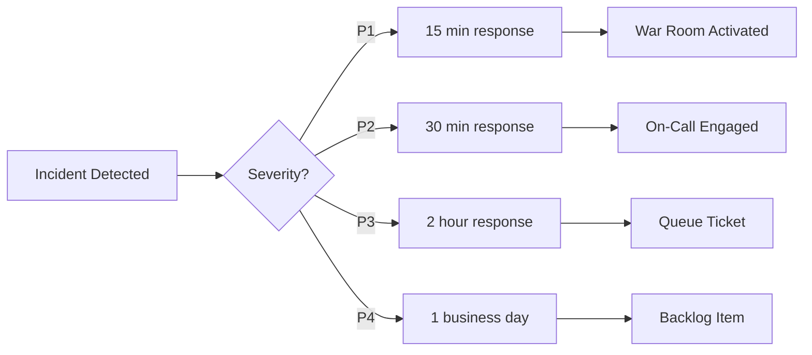

# Incident Response Runbook

## Document Information

| Field | Value |
|-------|-------|
| Version | 1.0 |
| Last Updated | 2026-02-18 |
| Owner | Operations Team |
| Status | Active |

---

## Table of Contents

1. [Introduction](#1-introduction)
2. [Incident Classification](#2-incident-classification)
3. [Response Procedures](#3-response-procedures)
4. [Common Incident Scenarios](#4-common-incident-scenarios)
5. [Post-Incident Procedures](#5-post-incident-procedures)
6. [Appendices](#6-appendices)

---

## 1. Introduction

### 1.1 Purpose

This runbook provides standardized procedures for responding to production incidents affecting the E-Commerce platform. It ensures consistent, timely, and effective incident management to minimize service disruption and customer impact.

### 1.2 Scope

This runbook covers:
- All production services: API, Database, Storefront, Admin Dashboard
- Third-party integrations: Payment processors, Email services
- Infrastructure components: Docker containers, Networks, Volumes

### 1.3 Incident Severity Levels

| Level | Name | Description | Response Time | Resolution Target |
|-------|------|-------------|---------------|-------------------|
| P1 | Critical | Complete service outage, data breach, payment failure | 15 minutes | 4 hours |
| P2 | High | Partial service degradation, checkout issues | 30 minutes | 8 hours |
| P3 | Medium | Performance degradation, non-critical feature failure | 2 hours | 24 hours |
| P4 | Low | Minor bugs, cosmetic issues | 1 business day | 1 week |

### 1.4 Response Time SLAs



---

## 2. Incident Classification

### 2.1 Critical - P1

**Definition:** Complete service outage or security incident with immediate business impact.

**Examples:**
- Complete service outage - all users unable to access platform
- Data breach or security incident
- Payment processing completely failed
- Database corruption or data loss
- SSL certificate expired
- Authentication service completely down

**Impact:**
- Revenue loss exceeding $1000/hour
- Customer data at risk
- Complete inability to process transactions

**Response:**
1. Immediate page to on-call engineer and management
2. War room established within 15 minutes
3. All hands on deck
4. Executive notification within 30 minutes
5. Customer communication within 1 hour

### 2.2 High - P2

**Definition:** Significant service degradation affecting core functionality.

**Examples:**
- Checkout process intermittently failing
- Search functionality down
- Admin dashboard inaccessible
- Payment processing delayed
- API response times exceeding 10 seconds
- Database connection pool exhaustion

**Impact:**
- Degraded user experience
- Potential revenue impact
- Customer complaints

**Response:**
1. Page on-call engineer
2. Incident commander assigned within 30 minutes
3. Subject matter expert engaged
4. Status page updated

### 2.3 Medium - P3

**Definition:** Partial functionality affected with workaround available.

**Examples:**
- Product image upload failing
- Email notifications delayed
- Report generation slow
- Non-critical API endpoints returning errors
- Performance degradation under load
- Individual feature malfunction

**Impact:**
- Minor user inconvenience
- No immediate revenue impact
- Workaround available

**Response:**
1. Ticket created in queue
2. Assigned to appropriate team
3. Investigated during business hours
4. Status page note if user-facing

### 2.4 Low - P4

**Definition:** Minor issues with no significant business impact.

**Examples:**
- UI cosmetic issues
- Typos in content
- Minor validation errors
- Non-critical logging failures
- Documentation discrepancies

**Impact:**
- Minimal user impact
- No revenue impact

**Response:**
1. Added to backlog
2. Prioritized in sprint planning
3. Fixed in regular release cycle

---

## 3. Response Procedures

### 3.1 Initial Response Checklist

```markdown
## Incident Detection
[ ] Incident detected via: _______________
[ ] Time detected: _______________
[ ] Initial reporter: _______________

## Initial Assessment
[ ] Confirm the incident is real
[ ] Determine affected services
[ ] Estimate user impact
[ ] Assign initial severity level
[ ] Check recent deployments/changes

## Communication Setup
[ ] Create incident channel: #incident-YYYY-MM-DD-NN
[ ] Assign incident commander: _______________
[ ] Notify relevant team members
[ ] Update status page if user-facing

## Investigation
[ ] Check application logs
[ ] Check database connectivity
[ ] Check third-party service status
[ ] Review recent changes
[ ] Check monitoring dashboards
```

### 3.2 Escalation Matrix

#### Internal Escalation

| Level | Role | Contact | Escalation Trigger |
|-------|------|---------|-------------------|
| L1 | On-Call Engineer | [ON_CALL_PHONE] | Initial response |
| L2 | Senior Engineer | [SENIOR_ENGINEER_PHONE] | 30 min no resolution |
| L3 | Engineering Manager | [MANAGER_PHONE] | 1 hour no resolution |
| L4 | CTO/VP Engineering | [CTO_PHONE] | P1 incidents |
| L5 | CEO | [CEO_PHONE] | Data breach, major outage |

#### External Escalation

| Service | Provider | Contact | When to Escalate |
|---------|----------|---------|------------------|
| Cloud Hosting | [PROVIDER_NAME] | [SUPPORT_PHONE] | Infrastructure issues |
| Database | PostgreSQL | [DB_SUPPORT] | Database corruption |
| Payments - Stripe | Stripe | [STRIPE_SUPPORT] | Payment processing issues |
| Payments - PayPal | PayPal | [PAYPAL_SUPPORT] | Payment processing issues |
| Email - SendGrid | Twilio | [SENDGRID_SUPPORT] | Email delivery issues |

### 3.3 Communication Templates

#### Internal Communication Template

```
INCIDENT NOTIFICATION

Severity: [P1/P2/P3/P4]
Status: [Investigating/Identified/Monitoring/Resolved]
Time Detected: [TIMESTAMP]
Incident Commander: [NAME]

Summary:
[Brief description of the incident]

Impact:
[Description of user/business impact]

Current Actions:
- [Action 1]
- [Action 2]

Next Update: [TIME]
Incident Channel: #incident-[DATE]-[NN]
```

#### External/Customer Communication Template

```
SERVICE ALERT

We are currently experiencing issues with [SERVICE/FEATURE].

Impact: Users may experience [DESCRIPTION OF IMPACT]

Our team is actively working to resolve this issue. We will provide updates every [TIMEFRAME] until resolved.

Current Status: [Investigating/Identified/Implementing Fix/Monitoring]

For the latest updates, please check our status page: [STATUS_PAGE_URL]

We apologize for any inconvenience this may cause.

[Time of Update]
```

#### Resolution Communication Template

```
INCIDENT RESOLVED

The issue with [SERVICE/FEATURE] has been resolved.

Duration: [START_TIME] - [END_TIME]
Total Impact Time: [DURATION]

Summary:
[Brief description of what happened]

Resolution:
[Description of how it was fixed]

Preventive Measures:
[Actions being taken to prevent recurrence]

We apologize for any inconvenience. If you continue to experience issues, please contact support.

[Time of Resolution]
```

---

## 4. Common Incident Scenarios

### 4.1 Database Connection Failure

**Symptoms:**
- API returning 500 errors
- Health check failing for database
- Connection timeout errors in logs
- "Unable to connect to database" messages

**Diagnosis Steps:**

```bash
# Check database container status
docker ps -a | grep postgres

# Check database health
docker exec ecommerce_db pg_isready -U ecommerce -d ECommerceDb

# Check database logs
docker logs ecommerce_db --tail 100

# Check connection from API container
docker exec ecommerce_api curl -f http://localhost:5000/health/ready

# Check network connectivity
docker network inspect ecommerce-network
```

**Resolution Steps:**

1. **If database container is stopped:**
   ```bash
   docker start ecommerce_db
   # Wait for health check to pass
   docker logs -f ecommerce_db
   ```

2. **If connection pool exhausted:**
   ```bash
   # Restart API to reset connections
   docker restart ecommerce_api
   ```

3. **If database is unresponsive:**
   ```bash
   # Check disk space
   docker exec ecommerce_db df -h
   
   # Check for locks
   docker exec ecommerce_db psql -U ecommerce -d ECommerceDb -c "SELECT * FROM pg_locks;"
   
   # Kill long-running queries if needed
   docker exec ecommerce_db psql -U ecommerce -d ECommerceDb -c "SELECT pg_terminate_backend(pid) FROM pg_stat_activity WHERE state = 'active' AND query_start < NOW() - INTERVAL '5 minutes';"
   ```

4. **If data corruption suspected:**
   - Follow Disaster Recovery Plan
   - Contact database administrator
   - Consider failover to backup

### 4.2 API 5xx Errors

**Symptoms:**
- High error rate in monitoring
- Users reporting errors
- Frontend showing error messages
- Health check failures

**Diagnosis Steps:**

```bash
# Check API container status
docker ps -a | grep api

# Check API logs for errors
docker logs ecommerce_api --tail 200 | grep -i error

# Check API health endpoint
curl -f http://localhost:5000/health

# Check detailed health
curl http://localhost:5000/health/ready

# Check memory usage
docker stats ecommerce_api --no-stream

# Check recent deployments
git log --oneline -10
```

**Resolution Steps:**

1. **If memory issues:**
   ```bash
   # Check memory limits
   docker inspect ecommerce_api | grep -i memory
   
   # Restart container
   docker restart ecommerce_api
   ```

2. **If recent deployment caused issue:**
   ```bash
   # Rollback to previous version
   git log --oneline -5
   git checkout [PREVIOUS_COMMIT]
   docker-compose up --build -d api
   ```

3. **If configuration issue:**
   ```bash
   # Verify environment variables
   docker exec ecommerce_api env | grep -E 'ConnectionStrings|Jwt|ASPNETCORE'
   
   # Restart with correct configuration
   docker-compose up -d api
   ```

### 4.3 Payment Processing Failure

**Symptoms:**
- Customers unable to complete checkout
- Payment webhook failures
- Stripe/PayPal API errors
- Orders stuck in pending state

**Diagnosis Steps:**

```bash
# Check API logs for payment errors
docker logs ecommerce_api --tail 500 | grep -i payment

# Check payment service status
curl https://status.stripe.com
curl https://status.paypal.com

# Check webhook logs
docker logs ecommerce_api | grep -i webhook

# Check pending orders
docker exec ecommerce_db psql -U ecommerce -d ECommerceDb -c "SELECT * FROM \"Orders\" WHERE \"Status\" = 'Pending' AND \"CreatedAt\" > NOW() - INTERVAL '1 hour';"
```

**Resolution Steps:**

1. **If Stripe/PayPal outage:**
   - Update status page
   - Notify customers of payment delays
   - Monitor provider status page
   - Consider enabling alternative payment method

2. **If webhook failure:**
   ```bash
   # Check webhook secret configuration
   docker exec ecommerce_api env | grep PaymentWebhook
   
   # Manually verify pending payments
   # Use Stripe/PayPal dashboard to verify payment status
   ```

3. **If configuration issue:**
   ```bash
   # Verify API keys
   docker exec ecommerce_api env | grep -E 'Stripe|PayPal'
   
   # Restart API after fixing configuration
   docker-compose up -d api
   ```

### 4.4 Authentication Service Down

**Symptoms:**
- Users unable to log in
- Token validation failures
- "Unauthorized" errors
- Session issues

**Diagnosis Steps:**

```bash
# Check API logs for auth errors
docker logs ecommerce_api --tail 200 | grep -iE 'auth|token|jwt|unauthorized'

# Check JWT configuration
docker exec ecommerce_api env | grep Jwt

# Test auth endpoint
curl -X POST http://localhost:5000/api/auth/login -H "Content-Type: application/json" -d '{"email":"test@test.com","password":"test"}'

# Check database for user data
docker exec ecommerce_db psql -U ecommerce -d ECommerceDb -c "SELECT COUNT(*) FROM \"Users\";"
```

**Resolution Steps:**

1. **If JWT configuration issue:**
   ```bash
   # Verify JWT secret is set
   docker exec ecommerce_api env | grep JWT_SECRET_KEY
   
   # If missing, update .env and restart
   docker-compose up -d api
   ```

2. **If database issue:**
   - Follow database connection failure procedure

3. **If token expiration issues:**
   - Check JWT expiration settings
   - Consider clearing refresh tokens
   ```bash
   docker exec ecommerce_db psql -U ecommerce -d ECommerceDb -c "DELETE FROM \"RefreshTokens\" WHERE \"ExpiresAt\" < NOW();"
   ```

### 4.5 Memory/CPU Spikes

**Symptoms:**
- Slow response times
- Container crashes
- OOM errors
- High resource utilization alerts

**Diagnosis Steps:**

```bash
# Check container resource usage
docker stats --no-stream

# Check API memory
docker stats ecommerce_api --no-stream

# Check database resources
docker stats ecommerce_db --no-stream

# Check for memory leaks
docker exec ecommerce_api free -m

# Check process list
docker exec ecommerce_api ps aux

# Check for runaway queries
docker exec ecommerce_db psql -U ecommerce -d ECommerceDb -c "SELECT pid, query, state, query_start FROM pg_stat_activity WHERE state = 'active' ORDER BY query_start;"
```

**Resolution Steps:**

1. **If memory leak suspected:**
   ```bash
   # Restart affected container
   docker restart ecommerce_api
   
   # Monitor after restart
   docker stats ecommerce_api
   ```

2. **If runaway query:**
   ```bash
   # Terminate long-running query
   docker exec ecommerce_db psql -U ecommerce -d ECommerceDb -c "SELECT pg_terminate_backend([PID]);"
   ```

3. **If sustained high load:**
   - Consider scaling resources
   - Enable caching if not already
   - Review and optimize slow queries

### 4.6 SSL Certificate Expiry

**Symptoms:**
- Browser security warnings
- API connection failures
- HTTPS errors

**Diagnosis Steps:**

```bash
# Check certificate expiration
openssl s_client -connect yourdomain.com:443 2>/dev/null | openssl x509 -noout -dates

# Check certificate chain
openssl s_client -connect yourdomain.com:443 -showcerts

# Check reverse proxy logs
docker logs [nginx-proxy] --tail 100
```

**Resolution Steps:**

1. **If using Let's Encrypt:**
   ```bash
   # Renew certificate
   certbot renew
   
   # Reload reverse proxy
   docker exec [nginx-proxy] nginx -s reload
   ```

2. **If manual certificate:**
   - Obtain new certificate from CA
   - Update certificate files
   - Reload reverse proxy configuration

3. **Emergency workaround:**
   - Update DNS to point to backup server with valid certificate
   - Or temporarily use HTTP with warning to users

---

## 5. Post-Incident Procedures

### 5.1 Root Cause Analysis Template

```markdown
# Root Cause Analysis

## Incident Information
- **Incident ID:** [ID]
- **Date:** [DATE]
- **Duration:** [START] to [END]
- **Severity:** [P1/P2/P3/P4]
- **Incident Commander:** [NAME]

## Summary
[2-3 sentence summary of what happened]

## Timeline
| Time | Event | Action Taken |
|------|-------|--------------|
| [TIME] | [Event description] | [Action] |

## Root Cause
[Detailed explanation of the root cause]

## Contributing Factors
1. [Factor 1]
2. [Factor 2]
3. [Factor 3]

## Impact Assessment
- **Users Affected:** [Number/Percentage]
- **Revenue Impact:** [Amount]
- **Duration:** [Time]
- **Reputation Impact:** [Description]

## What Went Well
1. [Positive aspect 1]
2. [Positive aspect 2]

## What Could Be Improved
1. [Area for improvement 1]
2. [Area for improvement 2]

## Action Items
| Action | Owner | Due Date | Status |
|--------|-------|----------|--------|
| [Action] | [Name] | [Date] | [Status] |

## Lessons Learned
[Key takeaways from this incident]
```

### 5.2 Incident Report Template

```markdown
# Incident Report

## Executive Summary
[High-level summary for stakeholders]

## Incident Details

| Field | Value |
|-------|-------|
| Incident ID | [ID] |
| Severity | [P1/P2/P3/P4] |
| Start Time | [TIMESTAMP] |
| End Time | [TIMESTAMP] |
| Total Duration | [DURATION] |
| Services Affected | [LIST] |
| Incident Commander | [NAME] |

## Description
[Detailed description of the incident]

## User Impact
[Description of how users were affected]

## Root Cause
[Summary of root cause - link to full RCA if available]

## Resolution
[How the incident was resolved]

## Prevention Measures
[Steps being taken to prevent recurrence]

## Appendix
- [Link to logs]
- [Link to monitoring data]
- [Link to communications]
```

### 5.3 Follow-up Actions Checklist

```markdown
## Immediate - Within 24 Hours
[ ] Incident report completed
[ ] RCA initiated
[ ] Status page updated to resolved
[ ] Customer follow-up sent if needed

## Short-term - Within 1 Week
[ ] RCA completed and reviewed
[ ] Action items assigned
[ ] Monitoring improvements identified
[ ] Runbook updates if needed

## Long-term - Within 1 Month
[ ] All action items completed
[ ] Preventive measures implemented
[ ] Knowledge base updated
[ ] Training conducted if needed

## Review
[ ] Post-incident review meeting held
[ ] Lessons learned documented
[ ] Process improvements identified
```

---

## 6. Appendices

### 6.1 Quick Reference Commands

```bash
# Container Management
docker ps -a                          # List all containers
docker logs [container] --tail 100    # View recent logs
docker restart [container]            # Restart container
docker stats --no-stream              # Resource usage

# Database
docker exec ecommerce_db psql -U ecommerce -d ECommerceDb
docker exec ecommerce_db pg_isready -U ecommerce
docker exec ecommerce_db psql -U ecommerce -d ECommerceDb -c "[QUERY]"

# Health Checks
curl http://localhost:5000/health
curl http://localhost:5000/health/ready
curl http://localhost:3000            # Storefront
curl http://localhost:3001            # Admin

# Full Stack Restart
docker-compose restart
docker-compose up -d --build
```

### 6.2 Service Endpoints

| Service | Internal URL | External URL |
|---------|--------------|--------------|
| API | http://api:5000 | https://api.yourdomain.com |
| Storefront | http://storefront:5173 | https://yourdomain.com |
| Admin | http://admin:5177 | https://admin.yourdomain.com |
| Database | postgres:5432 | N/A |

### 6.3 Monitoring Dashboards

| Dashboard | Purpose | URL |
|-----------|---------|-----|
| Application Health | Overall system health | [GRAFANA_URL]/d/app-health |
| API Metrics | API performance | [GRAFANA_URL]/d/api-metrics |
| Database Metrics | Database performance | [GRAFANA_URL]/d/db-metrics |
| Error Tracking | Error rates and details | [SENTRY_URL] |

### 6.4 Contact Directory Template

```markdown
## Internal Contacts

| Role | Name | Phone | Email | Slack |
|------|------|-------|-------|-------|
| On-Call Engineer | [NAME] | [PHONE] | [EMAIL] | @handle |
| Senior Engineer | [NAME] | [PHONE] | [EMAIL] | @handle |
| Engineering Manager | [NAME] | [PHONE] | [EMAIL] | @handle |
| CTO | [NAME] | [PHONE] | [EMAIL] | @handle |
| CEO | [NAME] | [PHONE] | [EMAIL] | @handle |

## External Contacts

| Service | Provider | Support Phone | Support Email | Account ID |
|---------|----------|---------------|---------------|------------|
| Cloud Hosting | [PROVIDER] | [PHONE] | [EMAIL] | [ID] |
| Stripe | Stripe | [PHONE] | support@stripe.com | [ID] |
| PayPal | PayPal | [PHONE] | [EMAIL] | [ID] |
| SendGrid | Twilio | [PHONE] | [EMAIL] | [ID] |
```

---

## Document History

| Version | Date | Author | Changes |
|---------|------|--------|---------|
| 1.0 | 2026-02-18 | Operations Team | Initial version |

---

*This document should be reviewed and updated quarterly or after any significant incident.*
