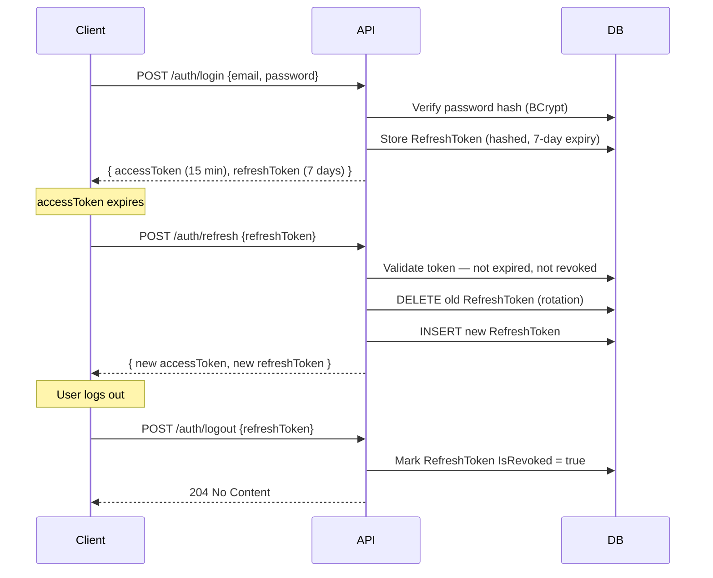
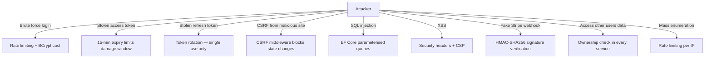

# Security Model

---

## Authentication — JWT + Refresh Token Rotation



**Key properties:**
- Access tokens: short-lived (15 min), stateless JWT — no DB lookup on every request
- Refresh tokens: long-lived (7 days), stored hashed in `RefreshTokens` table
- **Token rotation** — every refresh issues a new refresh token and revokes the old one. A stolen token can only be used once before it's invalidated
- Logout revokes the refresh token server-side — the access token remains valid until its 15 min expiry (acceptable tradeoff; use token blacklist for stricter requirements)

---

## Authorization — Role-Based Access Control

Two roles defined in `UserRole` enum:

| Role | Value | Access |
|------|-------|--------|
| `Customer` | 0 | Public endpoints + own data only |
| `Admin` | 1 | All endpoints including admin-only |

Controllers use standard ASP.NET Core policy attributes:

```csharp
[Authorize]                          // any authenticated user
[Authorize(Roles = "Admin")]         // admin only
// no attribute = public
```

**Ownership enforcement** — services check `ICurrentUserService.UserId` before returning user-scoped data. A customer cannot read another customer's orders even with a valid JWT.

---

## Password Security

| Concern | Implementation |
|---------|---------------|
| Storage | BCrypt hash — never stored in plaintext |
| Reset flow | Cryptographic random token, stored hashed, 1-hour expiry |
| Reset token exposure | Token sent via email only, not returned in API response |
| Min strength | Enforced via FluentValidation on `RegisterDto` / `ChangePasswordDto` |

---

## Input Validation

All write endpoints (POST, PUT, PATCH) are decorated with `[ValidationFilter]`. This intercepts the request before it reaches the controller action and returns `422 Unprocessable Entity` with field-level errors if validation fails.

Validators live in `ECommerce.Application/Validators/`. Every DTO has a corresponding `AbstractValidator<T>`.

**Common validations enforced:**
- Email format + uniqueness check
- Price / quantity — must be positive
- String length limits matching DB column sizes
- Enum range checks
- Required field checks

---

## CSRF Protection

The API uses `CsrfMiddleware` which requires a CSRF token header on state-changing requests from browser clients. The token is issued as a cookie and must be echoed back as a request header — the double-submit cookie pattern.

This protects against cross-site request forgery on authenticated endpoints.

---

## Rate Limiting

Applied at the ASP.NET Core middleware level. Current limits:

| Endpoint group | Limit |
|----------------|-------|
| `/auth/login` | 10 requests / minute per IP |
| `/auth/register` | 5 requests / minute per IP |
| `/auth/forgot-password` | 3 requests / minute per IP |
| All other endpoints | 100 requests / minute per IP |

Exceeds limit → `429 Too Many Requests`.

---

## Security Headers

`SecurityHeadersMiddleware` adds the following headers to every response:

| Header | Value |
|--------|-------|
| `X-Content-Type-Options` | `nosniff` |
| `X-Frame-Options` | `DENY` |
| `X-XSS-Protection` | `1; mode=block` |
| `Referrer-Policy` | `strict-origin-when-cross-origin` |
| `Content-Security-Policy` | restrictive policy (no inline scripts) |

---

## Stripe Webhook Verification

The `POST /payments/webhook` endpoint verifies the `Stripe-Signature` header using HMAC-SHA256 before processing any event. Requests without a valid signature are rejected with `401`.

This prevents attackers from spoofing payment events.

Implemented in `WebhookVerificationService.cs`.

---

## Sensitive Data Masking

`StringMaskingExtensions` in Core is used to mask sensitive fields (e.g. card numbers, tokens) before writing to logs. Serilog is configured to redact properties marked with `[SensitiveData]`.

**Never log:** passwords, raw tokens, card numbers, SSNs.

---

## CORS

CORS policy is configured in `Program.cs` via `CorsPolicyNames` constants. Only the known frontend origins (storefront and admin panel) are whitelisted.

In development: `http://localhost:5173`, `http://localhost:5174`
In production: configured via environment variable `AllowedOrigins`

---

## Threat Model Summary



---

## Security Checklist (before going to production)

- [ ] Replace JWT `SecretKey` with a cryptographically random 64-char key from a secrets manager
- [ ] Set `RefreshTokenExpiryDays` to your policy (7 days is a reasonable default)
- [ ] Configure real Stripe webhook signing secret
- [ ] Restrict `AllowedOrigins` to your production domain only
- [ ] Enable HTTPS-only (`UseHttpsRedirection`, `HSTS`)
- [ ] Set `Secure` + `HttpOnly` + `SameSite=Strict` flags on auth cookies
- [ ] Rotate DB credentials from defaults (`postgres/postgres`)
- [ ] Enable PostgreSQL SSL connection (`sslmode=require` in connection string)
- [ ] Review and tighten CSP for production (remove any `unsafe-*` directives)
- [ ] Set up alerts for repeated 401/403 spikes (potential credential stuffing)
