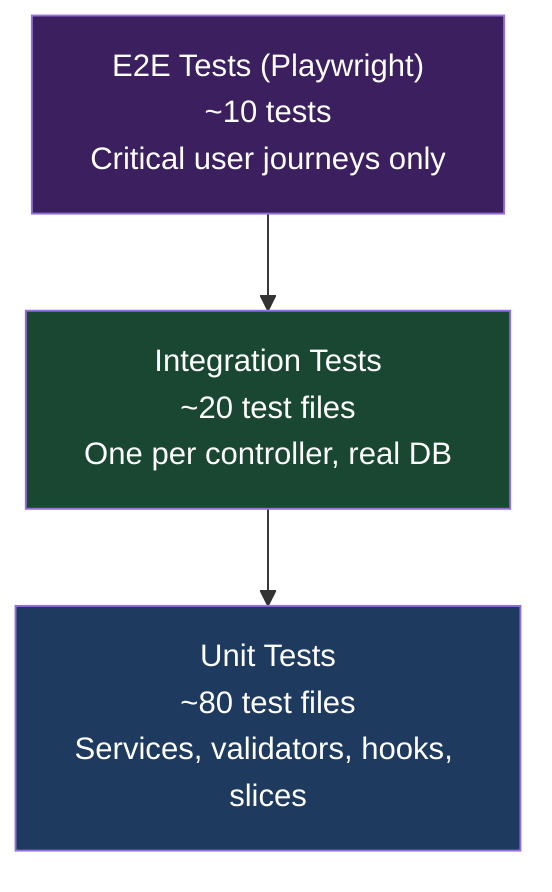

# Testing Guide

## Test pyramid



**Rule:** Most coverage lives in unit and integration tests. E2E tests cover the 3–5 most critical journeys only (checkout, login, product search).

---

## Running tests

### Backend

```bash
# All tests
cd src/backend
dotnet test

# Specific project
dotnet test ECommerce.Tests/

# With coverage
dotnet test --collect:"XPlat Code Coverage"

# Specific filter
dotnet test --filter "Category=Integration"
dotnet test --filter "FullyQualifiedName~OrderService"
```

### Frontend — unit

```bash
cd src/frontend/storefront
npm run test              # run once
npm run test:watch        # watch mode
npm run test:coverage     # with coverage report
```

### Frontend — E2E (Playwright)

```bash
cd src/frontend/storefront
npm run test:e2e          # headless
npm run test:e2e:ui       # with Playwright UI
```

Make sure the backend is running (`dotnet run`) before running E2E tests.

---

## Backend test structure

```
ECommerce.Tests/
├── ActionFilters/          ValidationFilter behaviour
├── Architecture/           NetArchTest dependency direction rules
├── Extensions/             Extension method unit tests
├── HealthChecks/           Health check unit tests
├── Integration/            One file per controller (real DB via TestWebApplicationFactory)
│   ├── AuthControllerTests.cs
│   ├── CartControllerTests.cs
│   ├── OrdersControllerTests.cs
│   └── ... (12 total)
├── Middleware/             GlobalExceptionMiddleware tests
├── Repositories/           Repository unit tests (mocked DbContext)
├── Services/               Service unit tests (mocked IUnitOfWork)
│   ├── AuthServiceTests.cs
│   ├── CartServiceTests.cs
│   └── ...
└── Validators/             FluentValidation validator tests
```

### Writing a service unit test

```csharp
[TestClass]
public class CartServiceTests
{
    private Mock<IUnitOfWork> _unitOfWork;
    private CartService _sut;

    [TestInitialize]
    public void Setup()
    {
        _unitOfWork = new Mock<IUnitOfWork>();
        _sut = new CartService(_unitOfWork.Object, ...);
    }

    [TestMethod]
    public async Task AddItem_WhenProductNotFound_ReturnsFailure()
    {
        // Arrange
        _unitOfWork.Setup(u => u.Products.GetByIdAsync(...))
                   .ReturnsAsync((Product?)null);

        // Act
        var result = await _sut.AddItemAsync(dto);

        // Assert
        Assert.IsFalse(result.IsSuccess);
        Assert.AreEqual(ErrorCodes.ProductNotFound, result.ErrorCode);
    }
}
```

**Rules:**
- Mock `IUnitOfWork`, not individual repositories directly
- Assert on `Result<T>.IsSuccess` and `Result<T>.ErrorCode` — not on exceptions
- One behaviour per test method — name it `Method_Condition_ExpectedOutcome`

### Writing an integration test

```csharp
public class OrdersControllerTests : IntegrationTestBase
{
    [TestMethod]
    public async Task CreateOrder_WithValidPayload_Returns201()
    {
        // Arrange — seed data via TestDataFactory
        var product = await TestDataFactory.CreateProductAsync(Client);

        // Act — use real HTTP client, real DB
        var response = await Client.PostAsJsonAsync("/api/orders", new { ... });

        // Assert
        Assert.AreEqual(HttpStatusCode.Created, response.StatusCode);
    }
}
```

Integration tests use `TestWebApplicationFactory`.

- Catalog runs against PostgreSQL Testcontainers by default for relational query/constraint fidelity.
- Other bounded contexts in this host remain in-memory for fast feedback unless explicitly changed.

Tests fail fast if Docker is unavailable.

---

## Frontend test structure

```
src/features/<feature>/
├── components/
│   └── ProductCard/
│       └── ProductCard.test.tsx    ← component render + interaction tests
├── hooks/
│   └── useProductFilters.test.ts   ← hook behaviour tests (renderHook)
└── slices/
    └── cartSlice.test.ts           ← Redux reducer unit tests
```

### Writing a component test

```tsx
import { render, screen, fireEvent } from '@testing-library/react'
import { renderWithProviders } from '@/test-utils'  // wraps with Redux + Router
import ProductCard from './ProductCard'

describe('ProductCard', () => {
  it('shows out-of-stock badge when stock is 0', () => {
    renderWithProviders(<ProductCard product={mockProduct({ stock: 0 })} />)
    expect(screen.getByText('Out of stock')).toBeInTheDocument()
  })

  it('dispatches addToCart on button click', async () => {
    const { store } = renderWithProviders(<ProductCard product={mockProduct()} />)
    fireEvent.click(screen.getByRole('button', { name: /add to cart/i }))
    expect(store.getState().cart.items).toHaveLength(1)
  })
})
```

**Rules:**
- Use `renderWithProviders` (in `src/test-utils/`) — never render components without Redux/Router context
- Test behaviour, not implementation — query by role/text, not by CSS class or component name
- Mock RTK Query endpoints via `msw` (Mock Service Worker) for API-dependent components
- Never snapshot test large component trees — use targeted assertions

### Writing a hook test

```ts
import { renderHook, act } from '@testing-library/react'
import { useCheckoutForm } from './useCheckoutForm'

it('persists form to localStorage on change', () => {
  const { result } = renderHook(() => useCheckoutForm())
  act(() => result.current.setField('city', 'Sofia'))
  expect(localStorage.getItem('checkout-draft')).toContain('Sofia')
})
```

---

## What to test (and what not to)

### Test these

| Type | Why |
|------|-----|
| Service business logic (all branches of `Result<T>`) | Core value; fast; no infra needed |
| Validator rules | Catch invalid DTOs before they reach services |
| Controller → service integration (real HTTP + DB) | Proves the wiring is correct |
| Redux reducers | Pure functions; trivial to test |
| Components with user interactions | Catches UI regressions |

### Don't test these

| Type | Why |
|------|-----|
| AutoMapper `MappingProfile` (trivial mappings) | Low value; breaks often; test the endpoint instead |
| EF Core queries in isolation | Test via integration tests with real DB |
| UI snapshots of large trees | Brittle; maintenance overhead exceeds value |
| Third-party library behaviour | Not your code |

---

## Coverage goals

| Layer | Target | Current |
|-------|--------|---------|
| Backend Services | 85%+ | ~80% |
| Backend Validators | 95%+ | ~90% |
| Backend Controllers (integration) | 100% happy path | ~100% |
| Frontend Components | 70%+ | ~65% |
| Frontend Hooks | 80%+ | ~75% |

Run coverage:
```bash
# Backend
dotnet test --collect:"XPlat Code Coverage"
reportgenerator -reports:"**/coverage.cobertura.xml" -targetdir:"coverage-report"

# Frontend
npm run test:coverage
```

Full testing strategy: `.ai/workflows/testing-strategy.md`
