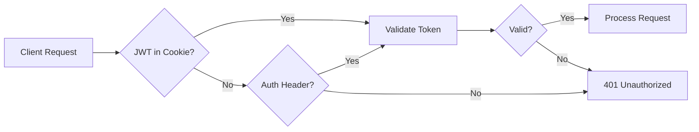
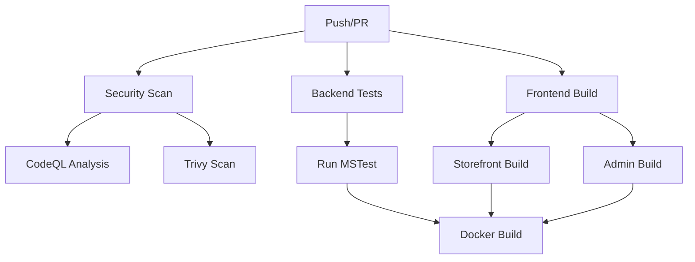

# Comprehensive Code Review Report - E-Commerce Platform

**Date:** February 24, 2026  
**Reviewer:** Code Review Analysis  
**Project:** E-Commerce Full-Stack Application (.NET 10 / React 19 / PostgreSQL)

---

## Executive Summary

This comprehensive code review analyzed the entire E-commerce platform codebase for security vulnerabilities, performance issues, code quality, maintainability, DRY violations, testing coverage, CI/CD completeness, documentation, error handling, logging, monitoring, and missing features.

### Overall Assessment

| Category | Rating | Status |
|----------|--------|--------|
| Architecture | ⭐⭐⭐⭐⭐ | Excellent |
| Security | ⭐⭐⭐⭐ | Good (Previously critical issues fixed) |
| Performance | ⭐⭐⭐⭐ | Good |
| Code Quality | ⭐⭐⭐⭐ | Good |
| Testing | ⭐⭐⭐ | Moderate |
| CI/CD | ⭐⭐⭐⭐ | Good |
| Documentation | ⭐⭐⭐⭐ | Good |
| Observability | ⭐⭐⭐ | Moderate |

### Key Findings Summary

**✅ Previously Critical Issues - NOW FIXED:**
1. Price manipulation vulnerability - Fixed with server-side price lookup
2. Hardcoded secrets - Fixed with environment variable configuration
3. IDOR vulnerabilities - Fixed with ownership checks
4. Race conditions - Fixed with optimistic concurrency tokens
5. JWT in localStorage - Fixed with httpOnly cookies

**⚠️ Remaining Issues Found:**
- 19 console.log statements in production frontend code
- Limited frontend test coverage
- Missing E2E tests in CI pipeline
- No automated deployment pipeline
- Missing API versioning
- Missing audit logging
- Missing GDPR compliance features

---

## 1. Security Analysis

### 1.1 Authentication & Authorization ✅

**Status:** Good

The application implements robust authentication:



**Strengths:**
- JWT tokens stored in httpOnly cookies (not localStorage)
- CSRF protection with X-XSRF-TOKEN header
- Rate limiting on auth endpoints (5 req/min for login, 3 req/15min for password reset)
- Proper token refresh mechanism
- Role-based authorization (Admin, SuperAdmin)

**Code Reference:** [`ServiceCollectionExtensions.cs`](src/backend/ECommerce.API/Extensions/ServiceCollectionExtensions.cs:42)
```csharp
// Supports reading JWT from httpOnly cookie
options.Events = new JwtBearerEvents
{
    OnMessageReceived = context =>
    {
        var accessToken = context.Request.Cookies["accessToken"];
        if (!string.IsNullOrEmpty(accessToken))
        {
            context.Token = accessToken;
        }
        return Task.CompletedTask;
    }
};
```

### 1.2 Input Validation ✅

**Status:** Good

- FluentValidation used throughout
- Validation filter attribute for automatic model validation
- Comprehensive DTO validators for all inputs

**Files Reviewed:**
- [`CreateProductDtoValidator.cs`](src/backend/ECommerce.Application/Validators/Products/CreateProductDtoValidator.cs)
- [`ProcessPaymentDtoValidator.cs`](src/backend/ECommerce.Application/Validators/Payments/ProcessPaymentDtoValidator.cs)
- [`CreateOrderDtoValidator.cs`](src/backend/ECommerce.Application/Validators/Orders/CreateOrderDtoValidator.cs)

### 1.3 IDOR Protection ✅

**Status:** Fixed

Ownership checks are now implemented in all sensitive endpoints:

**OrdersController:** [`OrdersController.cs`](src/backend/ECommerce.API/Controllers/OrdersController.cs:209)
```csharp
// Ownership check: retrieve order first
var order = await _orderService.GetOrderByIdAsync(id, cancellationToken);
if (!isAdmin && order.UserId != currentUserId)
{
    return StatusCode(403, ApiResponse<object>.Error("You do not have permission"));
}
```

**PaymentsController:** [`PaymentsController.cs`](src/backend/ECommerce.API/Controllers/PaymentsController.cs:97)
```csharp
// Check if user owns the order or is admin
if (!isAdmin && order.UserId != currentUserId)
{
    return StatusCode(403, ApiResponse<object>.Error("You do not have permission"));
}
```

### 1.4 Price Manipulation Prevention ✅

**Status:** Fixed

Server-side price lookup implemented:

**OrderService:** [`OrderService.cs`](src/backend/ECommerce.Application/Services/OrderService.cs:216)
```csharp
// 🔒 SECURITY FIX: Look up product from database to get authoritative price
var product = await _unitOfWork.Products.GetByIdAsync(productId, ...);
// 🔒 Use database price, not client-provided price
UnitPrice = product.Price,  // ✓ Server-side price
```

### 1.5 Concurrency Control ✅

**Status:** Fixed

Optimistic concurrency tokens added to critical entities:

**Product Entity:** [`Product.cs`](src/backend/ECommerce.Core/Entities/Product.cs:36)
```csharp
[Timestamp]
public byte[]? RowVersion { get; set; }
```

**Entity Configuration:** [`EntityConfigurations.cs`](src/backend/ECommerce.Infrastructure/Data/Configurations/EntityConfigurations.cs:69)
```csharp
// Enable RowVersion for optimistic concurrency
entity.Property(e => e.RowVersion).IsRowVersion();
```

### 1.6 CORS Configuration ✅

**Status:** Good

Separate policies for development and production:

```csharp
// Development - permissive for local development
policy.WithOrigins("http://localhost:5173", "http://localhost:5177")
    .AllowAnyMethod()
    .AllowAnyHeader()
    .AllowCredentials();

// Production - strict, configured origins only
policy.WithOrigins(allowedOrigins)
    .WithMethods("GET", "POST", "PUT", "DELETE", "OPTIONS", "PATCH")
    .WithHeaders("Content-Type", "Authorization", "Accept", "X-XSRF-TOKEN")
    .AllowCredentials();
```

### 1.7 Security Recommendations

| Priority | Issue | Recommendation |
|----------|-------|----------------|
| Medium | Missing API versioning | Implement URL-based API versioning (e.g., /api/v1/) |
| Medium | Missing audit logging | Add audit trail for sensitive operations |
| Low | Missing GDPR features | Add data export/deletion endpoints |
| Low | Missing CSP headers | Add Content-Security-Policy header |

---

## 2. Performance Analysis

### 2.1 Database Query Optimization ✅

**Status:** Good

No `GetAllAsync()` + `.Where()` patterns found. All queries use database-level filtering:

**ProductService:** [`ProductService.cs`](src/backend/ECommerce.Application/Services/ProductService.cs:137)
```csharp
// Push filtering to database instead of loading all products into memory
var searchQuery = _unitOfWork.Products
    .FindByCondition(p => p.IsActive &&
        EF.Functions.Like(p.Name.ToLower(), $"%{queryLower}%"), ...);
```

### 2.2 Database Indexes ✅

**Status:** Good

Proper indexes defined in [`EntityConfigurations.cs`](src/backend/ECommerce.Infrastructure/Data/Configurations/EntityConfigurations.cs):

```csharp
// Product indexes
entity.HasIndex(e => e.Slug).IsUnique();
entity.HasIndex(e => e.IsActive);
entity.HasIndex(e => e.IsFeatured);
entity.HasIndex(e => new { e.IsActive, e.Price });

// Order indexes
entity.HasIndex(e => e.OrderNumber).IsUnique();
entity.HasIndex(e => e.UserId);
entity.HasIndex(e => e.CreatedAt);
entity.HasIndex(e => e.Status);

// Cart indexes
entity.HasIndex(e => e.SessionId);
```

### 2.3 Caching ✅

**Status:** Good

Redis caching configured in [`ServiceCollectionExtensions.cs`](src/backend/ECommerce.API/Extensions/ServiceCollectionExtensions.cs):

```csharp
builder.Services.AddRedisCaching(builder.Configuration);
```

### 2.4 Frontend Performance ✅

**Status:** Good

- React.lazy for code splitting
- React.memo for expensive components
- Debounced search input
- Performance monitoring hooks
- Optimized image components

**Performance Monitoring:** [`usePerformanceMonitor.ts`](src/frontend/storefront/src/hooks/usePerformanceMonitor.ts)
```typescript
// Tracks LCP, FID, CLS, FCP, TTI
const metrics = {
  name: metric.name,
  value: metric.value,
  rating: metric.rating
};
```

### 2.5 Performance Recommendations

| Priority | Issue | Recommendation |
|----------|-------|----------------|
| Medium | Missing query result caching | Add Redis caching for frequently accessed data |
| Low | Missing response compression | Add response compression middleware |
| Low | Missing CDN configuration | Configure CDN for static assets |

---

## 3. Code Quality Analysis

### 3.1 Architecture ✅

**Status:** Excellent

Clean Architecture with proper layer separation:

```
┌─────────────────────────────────────┐
│     ECommerce.API                   │  ← Controllers, Middleware
└─────────────────────────────────────┘
              ↓
┌─────────────────────────────────────┐
│   ECommerce.Application             │  ← Services, DTOs, Validators
└─────────────────────────────────────┘
              ↓
┌─────────────────────────────────────┐
│     ECommerce.Core                  │  ← Entities, Enums, Interfaces
└─────────────────────────────────────┘
              ↑
┌─────────────────────────────────────┐
│  ECommerce.Infrastructure           │  ← Repositories, DbContext
└─────────────────────────────────────┘
```

### 3.2 Code Smells Found

#### 3.2.1 Console.log Statements in Production Code ⚠️

**Severity:** Medium  
**Files:** 19 instances found in frontend code

**Examples:**
- [`useOnlineStatus.ts:31`](src/frontend/storefront/src/hooks/useOnlineStatus.ts:31): `console.log('[useOnlineStatus] Back online')`
- [`usePerformanceMonitor.ts:39`](src/frontend/storefront/src/hooks/usePerformanceMonitor.ts:39): `console.group(...)`
- [`cartSlice.ts:31`](src/frontend/storefront/src/store/slices/cartSlice.ts:31): `console.error('Failed to load cart...')`

**Recommendation:** Replace with proper logging service or remove in production builds.

#### 3.2.2 DRY Violations

**API Base Configuration:**
Both storefront and admin have similar `getCsrfToken()` helper functions:

- [`storefront/src/store/api/baseApi.ts:9`](src/frontend/storefront/src/store/api/baseApi.ts:9)
- [`admin/src/store/api/authApi.ts:10`](src/frontend/admin/src/store/api/authApi.ts:10)

**Recommendation:** Extract to shared package.

### 3.3 Code Quality Strengths

- Comprehensive XML documentation comments
- Consistent naming conventions
- Proper use of async/await
- CancellationToken support throughout
- Proper error handling with custom exceptions
- Well-structured DTOs and validators

---

## 4. Testing Analysis

### 4.1 Backend Testing ✅

**Status:** Good

Comprehensive test suite in [`ECommerce.Tests`](src/backend/ECommerce.Tests):

| Category | Files | Coverage |
|----------|-------|----------|
| Unit Tests | 15+ service tests | Services, Validators, Middleware |
| Integration Tests | 12+ controller tests | All controllers covered |
| Test Helpers | MockHelpers, TestDataFactory | Reusable test utilities |

**Test Structure:**
```
ECommerce.Tests/
├── Unit/
│   ├── Services/ (15 files)
│   ├── Validators/ (6 files)
│   └── Middleware/ (1 file)
├── Integration/
│   ├── AuthControllerTests.cs
│   ├── OrdersControllerTests.cs
│   └── ... (12 files)
└── Helpers/
    ├── MockHelpers.cs
    └── TestDataFactory.cs
```

### 4.2 Frontend Testing ⚠️

**Status:** Moderate

**Storefront:**
- Test setup configured (Vitest)
- Some component tests exist:
  - [`ErrorBoundary.test.tsx`](src/frontend/storefront/src/components/__tests__/ErrorBoundary.test.tsx)
  - [`cartSlice.test.ts`](src/frontend/storefront/src/store/slices/__tests__/cartSlice.test.ts)
  - [`useCart.test.tsx`](src/frontend/storefront/src/hooks/__tests__/useCart.test.tsx)

**Admin:**
- Test setup configured (Vitest)
- No actual test files found

**Missing:**
- Comprehensive component tests
- Integration tests
- E2E tests in CI pipeline

### 4.3 Testing Recommendations

| Priority | Issue | Recommendation |
|----------|-------|----------------|
| High | Missing admin tests | Add comprehensive tests for admin panel |
| High | Missing E2E tests | Add Playwright E2E tests to CI |
| Medium | Low component coverage | Increase React component test coverage |
| Medium | Missing test coverage reports | Add coverage reporting to CI |

---

## 5. CI/CD Analysis

### 5.1 Current Pipeline ✅

**Status:** Good

GitHub Actions workflow in [`.github/workflows/ci.yml`](.github/workflows/ci.yml):



**Pipeline Features:**
- ✅ Security scanning (CodeQL, Trivy)
- ✅ Backend tests with PostgreSQL service
- ✅ Frontend builds for both apps
- ✅ Docker image builds
- ✅ Artifact upload

### 5.2 Missing CI/CD Features

| Feature | Status | Recommendation |
|---------|--------|----------------|
| E2E tests | ❌ Missing | Add Playwright tests to CI |
| Deployment | ❌ Commented out | Enable deployment job |
| Notification | ❌ Missing | Add Slack/Email notifications |
| Preview deployments | ❌ Missing | Add PR preview deployments |
| Dependency caching | ⚠️ Partial | Add npm cache for frontend |

### 5.3 Deployment Configuration

**Render.yaml:** [`render.yaml`](render.yaml) configured for:
- Web service (API)
- Static sites (Storefront, Admin)
- PostgreSQL database

**Docker:** [`docker-compose.yml`](docker-compose.yml) for local development

---

## 6. Documentation Analysis

### 6.1 Available Documentation ✅

| Document | Location | Status |
|----------|----------|--------|
| Architecture Plan | [`ARCHITECTURE_PLAN.md`](ARCHITECTURE_PLAN.md) | ✅ Comprehensive |
| Security Audit | [`SECURITY_AUDIT_REPORT.md`](SECURITY_AUDIT_REPORT.md) | ✅ Detailed |
| Code Review | [`CODE_REVIEW.md`](CODE_REVIEW.md) | ✅ Available |
| Deployment Guide | [`docs/DEPLOYMENT_GUIDE.md`](docs/DEPLOYMENT_GUIDE.md) | ✅ Available |
| Backend Coding Guide | [`docs/guides/BACKEND_CODING_GUIDE.md`](docs/guides/BACKEND_CODING_GUIDE.md) | ✅ Comprehensive |
| Frontend Coding Guide | [`docs/guides/FRONTEND_CODING_GUIDE.md`](docs/guides/FRONTEND_CODING_GUIDE.md) | ✅ Comprehensive |
| Contributing | [`CONTRIBUTING.md`](CONTRIBUTING.md) | ✅ Available |
| Code of Conduct | [`CODE_OF_CONDUCT.md`](CODE_OF_CONDUCT.md) | ✅ Available |

### 6.2 Missing Documentation

| Document | Recommendation |
|----------|----------------|
| API Versioning Strategy | Document versioning approach |
| Runbook | Add operational runbook |
| GDPR Compliance | Document data handling procedures |
| Performance Baseline | Document expected performance metrics |

---

## 7. Error Handling Analysis

### 7.1 Backend Error Handling ✅

**Status:** Good

**Global Exception Middleware:** [`GlobalExceptionMiddleware.cs`](src/backend/ECommerce.API/Middleware/GlobalExceptionMiddleware.cs)

**Custom Exceptions:**
- `ProductNotFoundException`
- `OrderNotFoundException`
- `InsufficientStockException`
- `InvalidPromoCodeException`
- And 15+ more domain-specific exceptions

**Error Response Format:**
```csharp
public class ErrorDetails
{
    public string Message { get; set; }
    public string? Details { get; set; }
    public int StatusCode { get; set; }
}
```

### 7.2 Frontend Error Handling ✅

**Status:** Good

- ErrorBoundary component for React errors
- useErrorHandler hook for API errors
- Toast notifications for user feedback
- Proper error state management in Redux

### 7.3 Error Handling Recommendations

| Priority | Issue | Recommendation |
|----------|-------|----------------|
| Low | Missing error codes | Add structured error codes for API errors |
| Low | Missing error tracking | Integrate error tracking service (Sentry) |

---

## 8. Logging Analysis

### 8.1 Backend Logging ✅

**Status:** Good

**Serilog Configuration:** [`appsettings.json`](src/backend/ECommerce.API/appsettings.json)
```json
{
  "Serilog": {
    "WriteTo": [
      { "Name": "Console" },
      { "Name": "File", "Args": { "path": "logs/app-.txt" } },
      { "Name": "File", "Args": { "path": "logs/security-.txt" } }
    ],
    "Enrich": ["FromLogContext", "WithMachineName", "WithCorrelationId"]
  }
}
```

**Logging Patterns:**
```csharp
_logger.LogInformation("Creating order. UserId: {UserId}", userId);
_logger.LogWarning("User {UserId} attempted to access order {OrderId}", currentUserId, id);
_logger.LogError(ex, "Error creating order");
```

### 8.2 Frontend Logging ⚠️

**Status:** Moderate

- Console logging used (should be replaced)
- Performance monitoring implemented
- Missing structured logging service

### 8.3 Logging Recommendations

| Priority | Issue | Recommendation |
|----------|-------|----------------|
| Medium | Missing log aggregation | Add ELK stack or cloud logging |
| Medium | Missing frontend logging | Replace console.log with logging service |
| Low | Missing audit logs | Add audit trail for sensitive operations |

---

## 9. Monitoring & Observability Analysis

### 9.1 Health Checks ✅

**Status:** Good

**Health Check Configuration:** [`ServiceCollectionExtensions.cs`](src/backend/ECommerce.API/Extensions/ServiceCollectionExtensions.cs)
```csharp
services.AddHealthChecks()
    .AddNpgSql(connectionString)
    .AddRedis(redisConnectionString)
    .AddCheck<MemoryHealthCheck>("memory");
```

**Custom Memory Health Check:** [`MemoryHealthCheck.cs`](src/backend/ECommerce.API/HealthChecks/MemoryHealthCheck.cs)

### 9.2 Missing Observability Features

| Feature | Status | Recommendation |
|---------|--------|----------------|
| APM | ❌ Missing | Add Application Insights or similar |
| Distributed Tracing | ❌ Missing | Add OpenTelemetry |
| Metrics | ⚠️ Partial | Add Prometheus metrics |
| Alerting | ❌ Missing | Configure alerts for errors/performance |
| Dashboards | ❌ Missing | Create monitoring dashboards |

---

## 10. Missing Features & Improvements

### 10.1 High Priority Missing Features

| Feature | Description | Impact |
|---------|-------------|--------|
| API Versioning | URL-based versioning (e.g., /api/v1/) | Maintainability |
| Audit Logging | Track sensitive operations | Compliance |
| E2E Tests | Playwright tests in CI | Quality |
| Admin Tests | Test coverage for admin panel | Quality |

### 10.2 Medium Priority Improvements

| Feature | Description | Impact |
|---------|-------------|--------|
| Feature Flags | Toggle features without deployment | Flexibility |
| Response Caching | Cache frequently accessed data | Performance |
| Rate Limiting per User | User-based rate limiting | Security |
| Webhook System | Notify external systems on events | Integration |

### 10.3 Low Priority Improvements

| Feature | Description | Impact |
|---------|-------------|--------|
| GDPR Compliance | Data export/deletion endpoints | Compliance |
| Multi-tenancy | Support multiple tenants | Scalability |
| Internationalization | Multi-language support | UX |
| Advanced Analytics | Sales and user analytics | Business |

---

## 11. Action Items Summary

### Immediate (P0)

| # | Action | Effort |
|---|--------|--------|
| 1 | Remove console.log statements from production code | Low |
| 2 | Add E2E tests to CI pipeline | Medium |
| 3 | Add admin panel tests | Medium |

### Short-term (P1)

| # | Action | Effort |
|---|--------|--------|
| 4 | Implement API versioning | Medium |
| 5 | Add audit logging | Medium |
| 6 | Configure log aggregation | Medium |
| 7 | Add error tracking service | Low |

### Long-term (P2)

| # | Action | Effort |
|---|--------|--------|
| 8 | Add APM/monitoring | Medium |
| 9 | Implement feature flags | Medium |
| 10 | Add GDPR compliance features | High |
| 11 | Create monitoring dashboards | Medium |

---

## 12. Conclusion

The E-commerce platform demonstrates a well-architected application with strong security foundations. The previously identified critical security vulnerabilities have been addressed:

- ✅ Price manipulation prevented with server-side validation
- ✅ Secrets externalized to environment variables
- ✅ IDOR vulnerabilities fixed with ownership checks
- ✅ Race conditions handled with optimistic concurrency
- ✅ Authentication secured with httpOnly cookies

The codebase follows Clean Architecture principles with proper separation of concerns. Backend testing is comprehensive, though frontend testing needs improvement. CI/CD pipeline is functional but missing deployment automation and E2E tests.

**Overall Recommendation:** The application is production-ready with the understanding that the identified improvements should be implemented in a phased approach.

---

**Report Generated:** February 24, 2026  
**Next Review:** After P0 items completion
