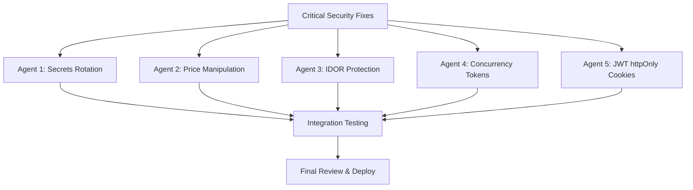

# Parallel Execution Plan for Security Fixes

This plan outlines how to run multiple agents in parallel to fix the critical security vulnerabilities identified in the production readiness assessment.

## Dependency Analysis

All 5 critical security issues are **independent** and can be fixed in parallel:



## Parallel Task Breakdown

### Agent 1: Secrets Rotation & Configuration
**Mode:** Code  
**Files to Modify:**
- `src/backend/ECommerce.API/appsettings.json`
- `docker-compose.yml`
- `.env.example`
- `src/backend/ECommerce.API/Program.cs`
- `src/backend/ECommerce.API/Extensions/ConfigurationExtensions.cs`

**Tasks:**
1. Remove hardcoded secrets from `appsettings.json`
2. Update `docker-compose.yml` to use environment variables
3. Create comprehensive `.env.example` template
4. Add startup validation for required secrets in `Program.cs`
5. Update configuration extensions to fail fast on missing secrets

**No conflicts with other agents** - works on configuration files only.

---

### Agent 2: Price Manipulation Fix
**Mode:** Code  
**Files to Modify:**
- `src/backend/ECommerce.Application/DTOs/Orders/OrderDtos.cs`
- `src/backend/ECommerce.Application/Services/OrderService.cs`
- `src/backend/ECommerce.Tests/Unit/Services/OrderServiceTests.cs`

**Tasks:**
1. Remove `Price`, `ProductName`, `ImageUrl` from `CreateOrderItemDto`
2. Update `OrderService.CreateOrderAsync` to lookup product prices from database
3. Recalculate order totals server-side
4. Add unit tests for price validation

**No conflicts with other agents** - works on order-related files only.

---

### Agent 3: IDOR Protection
**Mode:** Code  
**Files to Modify:**
- `src/backend/ECommerce.API/Controllers/OrdersController.cs`
- `src/backend/ECommerce.API/Controllers/PaymentsController.cs`
- `src/backend/ECommerce.API/Controllers/CartController.cs`
- `src/backend/ECommerce.Tests/Integration/OrdersControllerTests.cs`
- `src/backend/ECommerce.Tests/Integration/PaymentsControllerTests.cs`

**Tasks:**
1. Add ownership check to `OrdersController.CancelOrder`
2. Add ownership check to `PaymentsController.GetOrderPaymentDetails`
3. Add ownership check to `CartController.ValidateCart`
4. Add integration tests for IDOR protection

**No conflicts with other agents** - works on controller files only.

---

### Agent 4: Concurrency Tokens for Inventory
**Mode:** Code  
**Files to Modify:**
- `src/backend/ECommerce.Core/Entities/Product.cs`
- `src/backend/ECommerce.Core/Entities/PromoCode.cs`
- `src/backend/ECommerce.Core/Entities/Order.cs`
- `src/backend/ECommerce.Infrastructure/Repositories/ProductRepository.cs`
- `src/backend/ECommerce.Application/Services/OrderService.cs`
- `src/backend/ECommerce.Infrastructure/Data/Migrations/` (new migration)

**Tasks:**
1. Add `[Timestamp]` property to `Product`, `PromoCode`, `Order` entities
2. Update `ProductRepository.ReduceStockAsync` to use atomic SQL
3. Handle `DbUpdateConcurrencyException` in `OrderService`
4. Create new migration for concurrency tokens
5. Add tests for concurrent stock reduction

**No conflicts with other agents** - works on entity and repository files.

---

### Agent 5: JWT httpOnly Cookies Migration
**Mode:** Code  
**Files to Modify:**
- `src/backend/ECommerce.Application/Services/AuthService.cs`
- `src/backend/ECommerce.API/Controllers/AuthController.cs`
- `src/backend/ECommerce.API/Extensions/ServiceCollectionExtensions.cs`
- Frontend auth slices (multiple files)

**Tasks:**
1. Update `AuthService.LoginAsync` to set httpOnly cookies
2. Update `AuthController` logout to clear cookies
3. Configure CORS for credentials
4. Update frontend API slices to use `credentials: include`
5. Remove token from localStorage/Redux
6. Implement token refresh mechanism

**No conflicts with other agents** - works on auth-related files only.

---

## Execution Strategy

### Phase 1: Spawn All Agents (Parallel)

All 5 agents can be spawned simultaneously using the `new_task` tool. Each agent will work independently on their assigned files.

### Phase 2: Integration Testing (Sequential)

After all agents complete, run integration tests to verify:
- All fixes work together
- No regressions introduced
- End-to-end flows work correctly

### Phase 3: Final Review (Sequential)

Single agent reviews all changes for:
- Code consistency
- Documentation updates
- Final security verification

## How to Spawn Parallel Agents

Use the `new_task` tool to create multiple tasks. Each task will run in its own agent instance:

```
Task 1: Code mode - Secrets Rotation
Task 2: Code mode - Price Manipulation Fix
Task 3: Code mode - IDOR Protection
Task 4: Code mode - Concurrency Tokens
Task 5: Code mode - JWT httpOnly Cookies
```

## Conflict Prevention

The task breakdown ensures no file conflicts:
- Agent 1: Configuration files only
- Agent 2: Order DTOs and services only
- Agent 3: Controllers only
- Agent 4: Entities and repositories only
- Agent 5: Auth services and frontend only

## Expected Timeline

- **Parallel Phase:** All 5 agents work simultaneously
- **Integration Phase:** 1 agent for testing
- **Review Phase:** 1 agent for final review

Total time significantly reduced compared to sequential execution.
