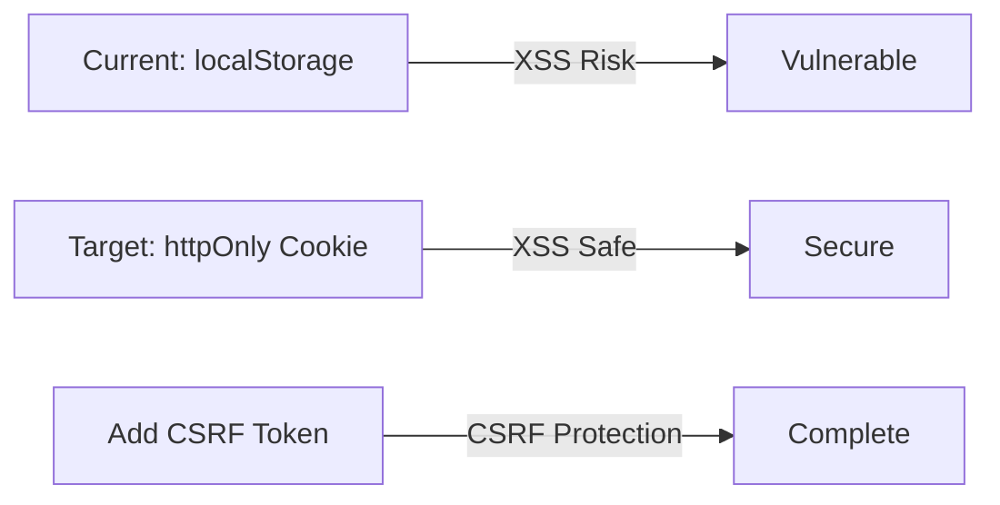
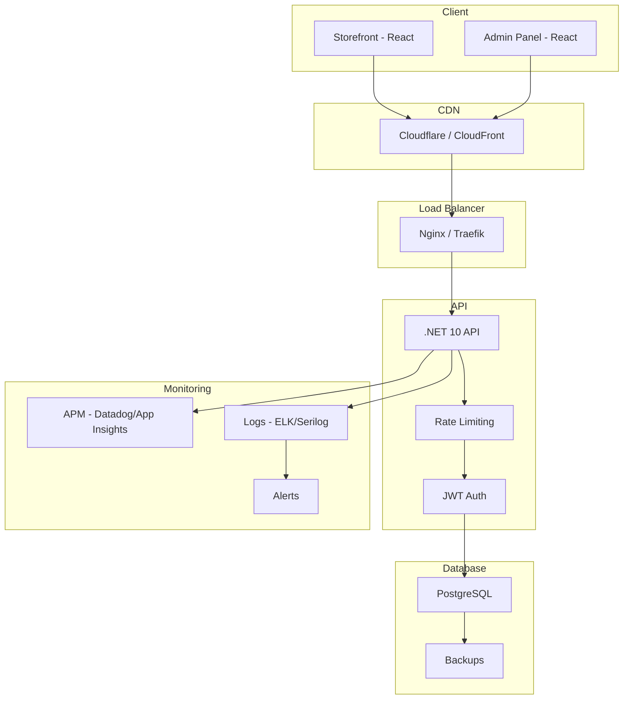

# Production Readiness Plan - E-Commerce Platform

**Last Updated:** February 18, 2026  
**Status:** 🟡 **MOSTLY READY** - Critical security issues fixed, infrastructure needs attention

---

## Executive Summary

Based on a comprehensive review of the codebase, significant security improvements have been made since the original assessment. The critical vulnerabilities identified in the original audit have been addressed, but several infrastructure and operational items remain before production deployment.

### Progress Overview

| Category | Previous Status | Current Status | Remaining Work |
|----------|-----------------|----------------|----------------|
| Security | 🔴 Critical | 🟡 Good | Token storage, CORS |
| Architecture | ⭐⭐⭐⭐⭐ | ⭐⭐⭐⭐⭐ | None |
| Testing | ⭐⭐⭐⭐ | ⭐⭐⭐⭐ | Frontend unit tests |
| CI/CD | ⭐⭐⭐ | ⭐⭐⭐ | CD pipeline, security scanning |
| Infrastructure | ⭐⭐⭐ | ⭐⭐⭐ | Monitoring, backups |
| Documentation | ⭐⭐⭐⭐ | ⭐⭐⭐⭐ | Runbooks, DR plan |

---

## ✅ COMPLETED - Critical Security Fixes

The following critical issues from the original assessment have been resolved:

### 1. ✅ Hardcoded Secrets Removed
- [`appsettings.json`](src/backend/ECommerce.API/appsettings.json) - Now uses empty strings, populated via environment variables
- [`docker-compose.yml`](docker-compose.yml) - Uses environment variable substitution with required validation
- [`.env.example`](.env.example) - Created with documentation for all required secrets

### 2. ✅ Price Manipulation Fixed
- [`OrderService.cs`](src/backend/ECommerce.Application/Services/OrderService.cs:216-234) - Server-side price lookup implemented
- Client-provided prices are ignored; database prices are used

### 3. ✅ IDOR Vulnerabilities Fixed
- [`OrdersController.cs`](src/backend/ECommerce.API/Controllers/OrdersController.cs:78-88) - Ownership validation added
- [`PaymentsController.cs`](src/backend/ECommerce.API/Controllers/PaymentsController.cs:108-118) - Ownership validation added

### 4. ✅ Concurrency Token Added
- [`Product.cs`](src/backend/ECommerce.Core/Entities/Product.cs:28-29) - `[Timestamp] RowVersion` property added for optimistic locking

### 5. ✅ Database Indexes Implemented
- [`AppDbContext.cs`](src/backend/ECommerce.Infrastructure/Data/AppDbContext.cs) - Comprehensive indexes added:
  - `Cart.SessionId`
  - `Product.IsActive`, `Product.IsFeatured`
  - `Order.UserId`, `Order.CreatedAt`, `Order.Status`
  - Composite indexes for common queries

### 6. ✅ Rate Limiting Configured
- [`ServiceCollectionExtensions.cs`](src/backend/ECommerce.API/Extensions/ServiceCollectionExtensions.cs:166-197) - Global and endpoint-specific limits

### 7. ✅ Security Headers Middleware
- [`SecurityHeadersMiddleware.cs`](src/backend/ECommerce.API/Middleware/SecurityHeadersMiddleware.cs) - Implemented

### 8. ✅ Input Validation
- Comprehensive FluentValidation validators for all DTOs

---

## 🔴 BLOCKING - Must Fix Before Production

### 1. JWT Tokens in localStorage (CRITICAL)

**Current State:** JWT tokens are stored in browser localStorage, making them vulnerable to XSS attacks.

**Files Affected:**
- [`storefront/src/store/slices/authSlice.ts`](src/frontend/storefront/src/store/slices/authSlice.ts:53)
- [`admin/src/store/slices/authSlice.ts`](src/frontend/admin/src/store/slices/authSlice.ts:79)
- Multiple API files read tokens from localStorage

**Risk:** Any XSS vulnerability can steal authentication tokens.

**Solution:**
1. Backend: Configure JWT authentication to emit httpOnly cookies
2. Frontend: Remove localStorage token handling
3. Add CSRF protection for cookie-based authentication



### 2. Production CORS Configuration

**Current State:** CORS policy is named AllowAll and may be too permissive.

**File:** [`ServiceCollectionExtensions.cs`](src/backend/ECommerce.API/Extensions/ServiceCollectionExtensions.cs)

**Solution:**
```csharp
// Replace AllowAll with production-specific origins
builder.Services.AddCors(options =>
{
    options.AddPolicy("Production", policy =>
    {
        policy.WithOrigins(
                "https://yourdomain.com",
                "https://admin.yourdomain.com"
              )
              .AllowAnyHeader()
              .AllowAnyMethod()
              .AllowCredentials();
    });
});
```

### 3. HTTPS Configuration

**Current State:** HTTPS redirect only enabled in non-development environments.

**Required:**
1. Obtain SSL certificate for production domain
2. Configure reverse proxy (Nginx/Traefik) with SSL termination
3. Enable HSTS headers in production

---

## ⚠️ HIGH PRIORITY - Infrastructure & Monitoring

### 4. Secret Management

**Current State:** Environment variables via docker-compose.

**Recommended:**
- Azure: Azure Key Vault
- AWS: AWS Secrets Manager / Parameter Store
- Kubernetes: Kubernetes Secrets with external-secrets-operator

### 5. Monitoring & Alerting

**Missing:**
- Application Performance Monitoring (APM)
- Error tracking and alerting
- Log aggregation

**Recommended Stack:**
- APM: Application Insights / Datadog / Prometheus + Grafana
- Error Tracking: Sentry
- Logs: ELK Stack / Serilog sinks to cloud storage

### 6. Database Backups

**Required:**
- Automated daily backups
- Point-in-time recovery capability
- Backup retention policy
- Tested restore procedure

### 7. CDN for Static Assets

**Required for:**
- Product images
- Frontend static files (JS, CSS)
- Improved global performance

---

## 📋 MEDIUM PRIORITY - CI/CD & Testing

### 8. Security Scanning in CI

**Current CI:** [`ci.yml`](.github/workflows/ci.yml) - Only runs tests and builds

**Add:**
```yaml
# Add to CI pipeline
- name: Run SAST Scan
  uses: github/codeql-action/analyze@v3
  
- name: Run Dependency Scan
  uses: snyk/actions/node@master
```

### 9. CD Pipeline

**Missing:** Automated deployment pipeline

**Required:**
- Staging environment deployment on main branch
- Production deployment on release tags
- Rollback capability

### 10. Frontend Unit Tests

**Current State:** Only E2E tests with Playwright exist

**Missing:** Unit tests for React components

**Found:** Only one unit test file - [`cartSlice.test.ts`](src/frontend/storefront/src/store/slices/__tests__/cartSlice.test.ts)

**Recommended:**
- Add Vitest for unit testing
- Target 60%+ coverage for critical components

### 11. Load Testing

**Missing:** No load testing configuration

**Recommended:**
- k6 or Artillery for API load testing
- Test critical paths: product listing, checkout, payment

---

## 📝 LOWER PRIORITY - Documentation & Operations

### 12. Incident Response Runbook

**Required Content:**
- Common failure scenarios
- Escalation procedures
- Contact information
- Recovery procedures

### 13. Disaster Recovery Plan

**Required Content:**
- RTO/RPO definitions
- Backup and restore procedures
- Failover procedures
- Communication plan

### 14. Infrastructure as Code

**Missing:** No IaC configuration

**Recommended:**
- Terraform for cloud resources
- Kubernetes manifests or Helm charts
- Version-controlled infrastructure

---

## Deployment Checklist

Before deploying to production, complete the following:

### Pre-Deployment

- [ ] All critical security issues resolved
- [ ] Environment variables configured in production
- [ ] SSL certificate installed
- [ ] Database backups configured
- [ ] Monitoring and alerting set up
- [ ] CDN configured

### Deployment

- [ ] Run database migrations
- [ ] Verify health check endpoint
- [ ] Test authentication flow
- [ ] Test checkout flow
- [ ] Verify error logging

### Post-Deployment

- [ ] Monitor error rates
- [ ] Verify backup completion
- [ ] Test incident response procedures
- [ ] Document any issues

---

## Architecture Diagram



---

## Estimated Effort

| Priority | Items | Complexity |
|----------|-------|------------|
| Critical | 3 items | Moderate |
| High | 4 items | Moderate |
| Medium | 4 items | Low-Moderate |
| Lower | 3 items | Low |

---

## Next Steps

1. **Immediate:** Fix JWT token storage (blocking issue)
2. **This Week:** Configure CORS and HTTPS for production
3. **Before Launch:** Set up monitoring, backups, and security scanning
4. **Post-Launch:** Add CD pipeline, load testing, and documentation

---

## References

- [SECURITY_AUDIT_REPORT.md](../SECURITY_AUDIT_REPORT.md) - Original security findings
- [DEPLOYMENT.md](../DEPLOYMENT.md) - Deployment documentation
- [ARCHITECTURE_PLAN.md](../ARCHITECTURE_PLAN.md) - System architecture
