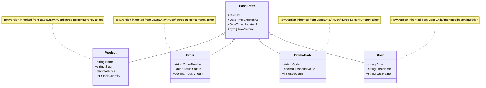

# RowVersion Duplication & Production Issues Remediation Plan

## Executive Summary

After analyzing the codebase and production logs, I've identified that **the RowVersion migration issues have been successfully resolved**. The `OptimizeRowVersionColumns` migration applied successfully on Render.com, and the database schema validation passes. 

The current production errors are **NOT related to RowVersion** - they are separate business logic issues that need to be addressed independently.

---

## Part 1: RowVersion Analysis (RESOLVED)

### Issue Identified

The codebase had a property shadowing issue where `RowVersion` was defined in both:

1. **[`BaseEntity.cs`](src/backend/ECommerce.Core/Common/BaseEntity.cs:11)** - Base class with `[Timestamp]` attribute
2. **Individual Entity Classes** - `Product`, `Order`, and `PromoCode` re-declare `RowVersion` with their own `[Timestamp]` attribute

### Entities with RowVersion Duplication

| Entity | Has Duplicate RowVersion | Configuration |
|--------|-------------------------|---------------|
| [`Product`](src/backend/ECommerce.Core/Entities/Product.cs:28) | ✅ Yes | `entity.Property(e => e.RowVersion).IsRowVersion()` |
| [`Order`](src/backend/ECommerce.Core/Entities/Order.cs:31) | ✅ Yes | `entity.Property(e => e.RowVersion).IsRowVersion()` |
| [`PromoCode`](src/backend/ECommerce.Core/Entities/PromoCode.cs:20) | ✅ Yes | `entity.Property(e => e.RowVersion).IsRowVersion()` |
| `User` | ❌ No | `entity.Ignore(e => e.RowVersion)` |
| `Category` | ❌ No | `entity.Ignore(e => e.RowVersion)` |
| `Review` | ❌ No | `entity.Ignore(e => e.RowVersion)` |
| `InventoryLog` | ❌ No | `entity.Ignore(e => e.RowVersion)` |

### Migration History

```
20260218134000_AddRowVersionToAllTables    → Added RowVersion to ALL tables
20260220081155_OptimizeRowVersionColumns   → Removed RowVersion from unnecessary tables
```

### Current Status: ✅ RESOLVED

The production logs confirm:
- `No pending migrations found` - All migrations applied
- `Database schema validation passed` - Schema is correct
- `Migrations applied successfully` - OptimizeRowVersionColumns ran successfully

---

## Part 2: Current Production Issues

### Issue 1: CartNotFoundException (HIGH PRIORITY)

**Error Message:**
```
CartNotFoundException: Cart for user with ID '623d323c-e108-4b71-a15a-fa22fe03f2f5' was not found.
```

**Root Cause:** The frontend is calling `GET /api/cart` which uses [`CartController.GetCart()`](src/backend/ECommerce.API/Controllers/CartController.cs:41) that calls [`CartService.GetCartAsync()`](src/backend/ECommerce.Application/Services/CartService.cs:60). This method throws an exception if no cart exists.

However, there's already a `POST /api/cart/get-or-create` endpoint that uses the get-or-create pattern.

**Recommended Fix (Choose One):**

**Option A: Change Frontend to Use Get-or-Create Endpoint**
- Frontend should call `POST /api/cart/get-or-create` instead of `GET /api/cart`
- This is the simplest fix and uses existing functionality

**Option B: Modify GetCart Endpoint to Use Get-or-Create Pattern**
- Change [`CartController.GetCart()`](src/backend/ECommerce.API/Controllers/CartController.cs:47) to call `GetOrCreateCartAsync` instead of `GetCartAsync`
- This ensures backward compatibility with frontend

**Option C: Create Cart on User Registration/Login**
- Add cart creation in `AuthService.Register()` or after successful login
- This ensures users always have a cart ready

### Issue 2: Redis Connection Failure (MEDIUM PRIORITY)

**Error Message:**
```
RedisConnectionException: It was not possible to connect to the redis server(s).
```

**Root Cause:** Redis is either not configured or not accessible in the Render.com environment.

**Recommended Fix:**
- Add Redis instance to Render.com deployment (using Render Redis service)
- OR set `AbortOnConnectFail=false` in Redis connection string
- OR disable Redis health check if not needed

### Issue 3: CSRF Token Missing (LOW PRIORITY)

**Error Message:**
```
CSRF validation failed: The required antiforgery cookie "XSRF-TOKEN" is not present.
```

**Root Cause:** Frontend not receiving/setting the XSRF-TOKEN cookie.

**Recommended Fix:**
- Ensure backend sends XSRF-TOKEN cookie on authentication
- Ensure frontend includes the token in request headers

---

## Part 3: Code Cleanup Recommendations

Even though the RowVersion issue is resolved, the code has redundancy that should be cleaned up:

### Recommended Changes

1. **Remove duplicate `RowVersion` properties from entity classes**
   - Remove from [`Product.cs`](src/backend/ECommerce.Core/Entities/Product.cs:28)
   - Remove from [`Order.cs`](src/backend/ECommerce.Core/Entities/Order.cs:31)
   - Remove from [`PromoCode.cs`](src/backend/ECommerce.Core/Entities/PromoCode.cs:20)
   - The inherited `RowVersion` from `BaseEntity` is sufficient

2. **Keep entity configurations as-is**
   - The `entity.Property(e => e.RowVersion).IsRowVersion()` configurations are correct
   - The `entity.Ignore(e => e.RowVersion)` configurations are correct

### Why This Works

When an entity inherits from `BaseEntity`, it inherits the `RowVersion` property. The entity configuration then either:
- Configures it as a concurrency token: `entity.Property(e => e.RowVersion).IsRowVersion()`
- Ignores it entirely: `entity.Ignore(e => e.RowVersion)`

The duplicate property declaration in derived classes is unnecessary and creates confusion.

---

## Part 4: Decision Matrix - Drop Tables vs. Corrective Migration

| Criteria | Drop Tables | Corrective Migration |
|----------|-------------|---------------------|
| **Data Loss** | ❌ All data lost | ✅ Data preserved |
| **Complexity** | ✅ Simple | ⚠️ Moderate |
| **Risk** | ⚠️ High (irreversible) | ✅ Low |
| **Downtime** | ⚠️ Required | ✅ Minimal |
| **Current Need** | ❌ Not needed | ❌ Not needed |

### Recommendation: **NEITHER REQUIRED**

The migrations have already applied successfully. The database schema is correct. No table dropping or corrective migration is needed.

---

## Part 5: Action Items

### Immediate Actions (Fix Current Production Errors)

- [ ] **Fix CartNotFoundException** - Implement get-or-create pattern in CartService
- [ ] **Configure Redis** - Add Redis to Render.com or disable Redis health check
- [ ] **Fix CSRF Token** - Ensure XSRF-TOKEN cookie is properly set and sent

### Code Cleanup Actions (Non-Urgent)

- [ ] Remove duplicate `RowVersion` properties from `Product`, `Order`, `PromoCode` entities
- [ ] Add code documentation explaining the RowVersion inheritance pattern
- [ ] Add unit tests to verify RowVersion behavior

### Prevention Actions

- [ ] Add integration tests for migration scenarios
- [ ] Implement database schema validation in CI/CD pipeline
- [ ] Add monitoring for migration failures

---

## Architecture Diagram



---

## Conclusion

**The RowVersion issue is RESOLVED.** No table dropping or corrective migration is needed. The current production errors are unrelated to RowVersion and should be addressed separately:

1. **Cart creation logic** needs to be fixed
2. **Redis configuration** needs to be addressed
3. **CSRF token handling** needs verification

The code cleanup (removing duplicate RowVersion properties) is recommended for maintainability but is not urgent.
